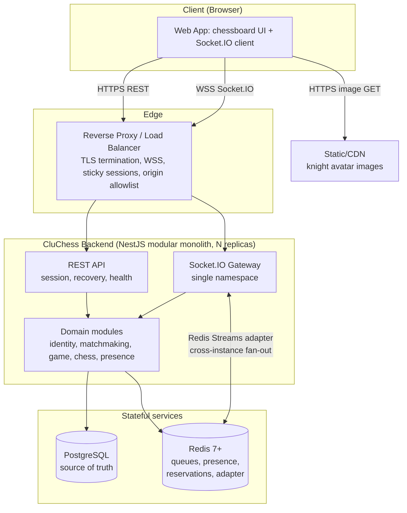
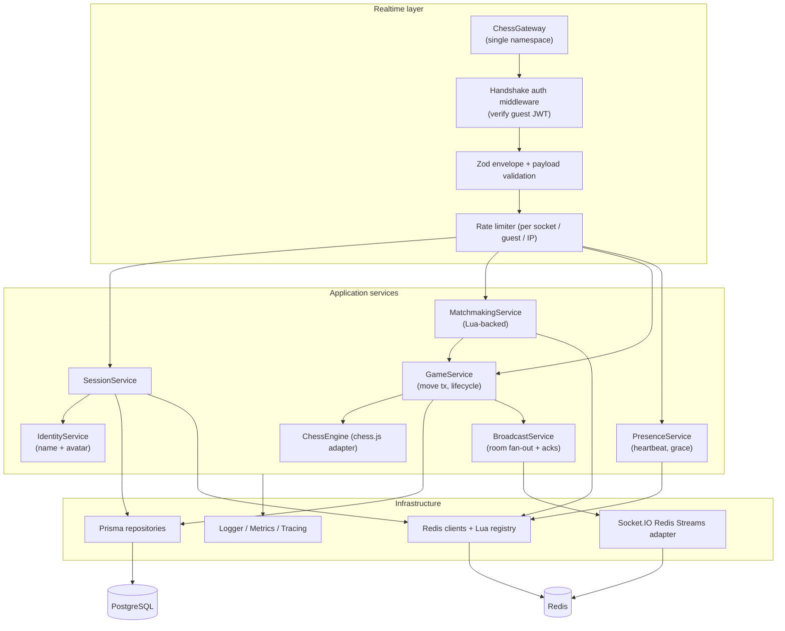
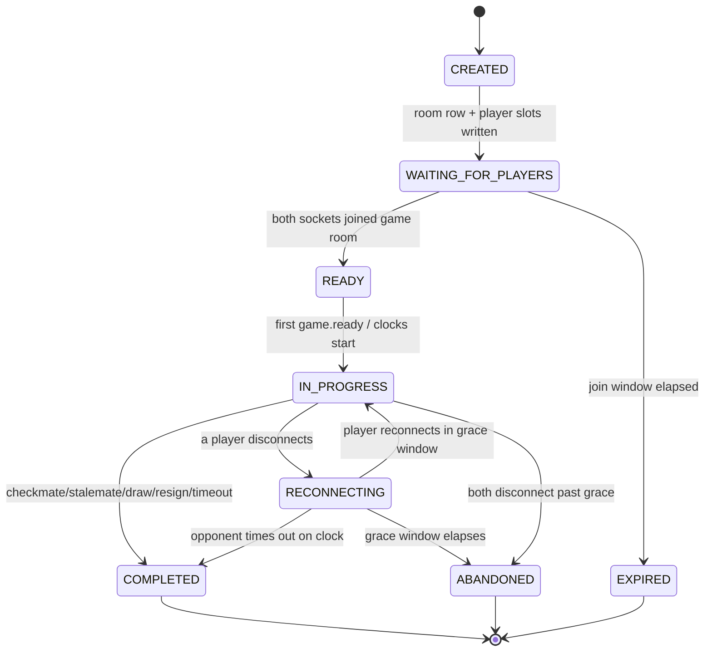
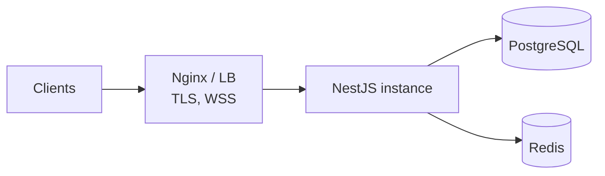
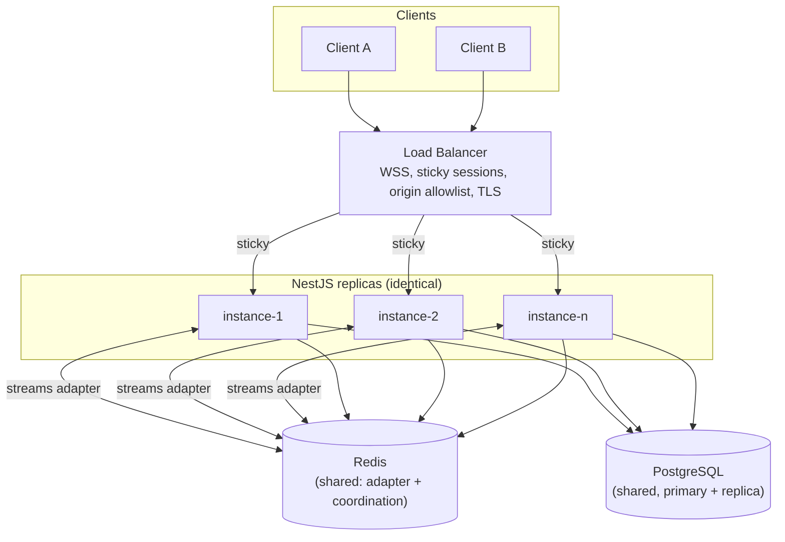

# CluChess — Backend Architecture

> **Status:** Approved architecture (v1.1). Phase 0 decisions are accepted; runtime implementation has not begun.
> **Audience:** Backend engineers and AI coding agents implementing the CluChess MVP.
> **Scope:** Server-authoritative, anonymous, instant-matchmaking real-time chess. MVP first, horizontal scale second.
> **Decision authority:** Accepted records in [`docs/adr/`](docs/adr/) and the normative [`docs/protocol-v1.md`](docs/protocol-v1.md) refine this blueprint and take precedence over older prose where explicitly noted.

---

## Table of contents

1. [Executive summary](#1-executive-summary)
2. [Goals and non-goals](#2-goals-and-non-goals)
3. [Functional requirements](#3-functional-requirements)
4. [Non-functional requirements](#4-non-functional-requirements)
5. [Capacity assumptions and calculations](#5-capacity-assumptions-and-calculations)
6. [Final technology stack](#6-final-technology-stack)
7. [Architecture principles](#7-architecture-principles)
8. [System context diagram](#8-system-context-diagram)
9. [Component architecture](#9-component-architecture)
10. [Backend modules and responsibilities](#10-backend-modules-and-responsibilities)
11. [Suggested folder structure](#11-suggested-folder-structure)
12. [Anonymous-session architecture](#12-anonymous-session-architecture)
13. [Matchmaking design and pseudocode](#13-matchmaking-design-and-pseudocode)
14. [Game-room state machine](#14-game-room-state-machine)
15. [Chess-engine integration](#15-chess-engine-integration)
16. [Socket.IO connection lifecycle](#16-socketio-connection-lifecycle)
17. [Event protocol and JSON examples](#17-event-protocol-and-json-examples)
18. [HTTP API](#18-http-api)
19. [PostgreSQL schema](#19-postgresql-schema)
20. [Redis key design](#20-redis-key-design)
21. [Concurrency and idempotency](#21-concurrency-and-idempotency)
22. [Horizontal scaling](#22-horizontal-scaling)
23. [Failure recovery](#23-failure-recovery)
24. [Security and abuse prevention](#24-security-and-abuse-prevention)
25. [Observability](#25-observability)
26. [Testing and load testing](#26-testing-and-load-testing)
27. [Deployment](#27-deployment)
28. [Phased implementation roadmap](#28-phased-implementation-roadmap)
29. [Risks and trade-offs](#29-risks-and-trade-offs)
30. [Future extensions](#30-future-extensions)
31. [Final architecture decisions](#31-final-architecture-decisions)
32. [Acceptance checklist](#32-acceptance-checklist)
33. [References](#33-references)

---

## 1. Executive summary

CluChess is an anonymous, instant-matchmaking chess platform — "Tinder for chess" in the sense of *fast anonymous pairing*, not swiping or browsing. A visitor lands, is issued an anonymous guest identity (a Reddit-style name such as `SilentKnight482` plus a knight/horse avatar), joins a queue, is paired with another waiting stranger in a private two-player room, and plays real-time chess. The server validates and persists every move and is the sole authority on legality, turn, and result.

The backend is a **NestJS modular monolith** on **Node.js 24 LTS / TypeScript strict**, exposing a **single Socket.IO 4.x namespace** for real-time play and a thin **REST surface** for session bootstrap, recovery, and health. **PostgreSQL (via Prisma)** is the durable source of truth for games, moves, results, and monotonic game versions. **Redis 7+** holds only ephemeral coordination state — matchmaking queues, reservations, presence, rate-limit counters, and the Socket.IO cross-instance adapter. **`chess.js`** performs move generation, validation, and game-over detection behind an internal `ChessEngine` interface.

Correctness is guaranteed by **PostgreSQL constraints and optimistic version checks**, not by Redis locks. Redis accelerates and coordinates; it never decides truth. Matchmaking atomicity comes from **Redis Lua scripts**; move idempotency comes from a **`UNIQUE(game_id, client_move_id)`** constraint plus a **monotonic `version` column**. The system starts as one instance and scales to N identical replicas behind a sticky-session load balancer, with the **`@socket.io/redis-streams-adapter`** fanning room events across instances.

The design targets **1,000+ DAU** with a justified **peak of ~2,500 concurrent connections / ~1,000 simultaneous games**, verified by an **Artillery Socket.IO load profile** covering 2,000 connections, matchmaking churn, concurrent moves, and reconnection.

---

## 2. Goals and non-goals

### Goals

- Anonymous guest identity issued in one round-trip, surviving page refresh.
- Sub-second matchmaking when an opponent is waiting.
- Server-authoritative chess: the client renders; the server decides.
- Exactly-two-player private rooms with server-assigned colors.
- Every accepted move validated and durably persisted before broadcast.
- Deterministic, idempotent behavior under duplicates, retries, races, and crashes.
- Reconnection that always yields an authoritative snapshot.
- One instance for MVP; N identical instances with no change in observable behavior.
- Operable by a small team: one monolith, two datastores, standard tooling.

### Non-goals (MVP)

- Accounts, login, email, OAuth, or persistent profiles.
- Swiping, profile browsing, friend lists, or direct messaging.
- Chess ratings / Elo, leaderboards, tournaments.
- Time controls other than a single default clock (clocks are in scope; *selectable* time controls are a future extension point).
- Rematch, private invite rooms, spectating (designed as extension points, not built).
- Multiple game modes / variants.
- Kafka/NATS/RabbitMQ, Kubernetes, or independent microservices.
- Native mobile apps (web client only; the backend is client-agnostic).

---

## 3. Functional requirements

| # | Requirement |
|---|---|
| FR-1 | Create an anonymous guest session on first visit and return credential, display name, and avatar key. |
| FR-2 | Renew and retrieve the current session; reset ("logout") identity on request. |
| FR-3 | Authenticate the Socket.IO handshake using the guest credential. |
| FR-4 | Join / leave the matchmaking queue with FIFO fairness. |
| FR-5 | Pair exactly two distinct waiting users into one private room, atomically. |
| FR-6 | Randomly assign white/black server-side. |
| FR-7 | Validate every move (player, color, turn, legality, promotion, castling, en passant, check/mate/stalemate, draws) with `chess.js`. |
| FR-8 | Persist every accepted move idempotently and update authoritative game state. |
| FR-9 | Broadcast accepted moves and game-end to both players. |
| FR-10 | End games via checkmate, stalemate, draw (insufficient material, threefold, fifty-move, agreement not in MVP), resignation, timeout, or abandonment. |
| FR-11 | Detect disconnects, offer a reconnection grace window, and restore authoritative state on reconnect. |
| FR-12 | Enforce: never in two queues, never in two active games, never matched with self, never double-assigned. |
| FR-13 | Provide HTTP recovery of the current active game and a full game snapshot. |
| FR-14 | Expose liveness, readiness, and (restricted) metrics endpoints. |

---

## 4. Non-functional requirements

| Category | Requirement |
|---|---|
| **Correctness** | Server-authoritative; PostgreSQL constraints/version checks are the final arbiter. No duplicate persisted moves; no double game assignment. |
| **Availability** | Redis outage degrades matchmaking but must not corrupt or lose in-progress games. PostgreSQL outage fails move commits closed (reject, never fabricate). |
| **Latency (targets, p95 unless noted)** | Guest-session create ≤ 150 ms; WS connect (post-TLS) ≤ 300 ms; match when opponent waiting ≤ 500 ms; move validate+persist ≤ 50 ms server-side; broadcast fan-out ≤ 50 ms; reconnect + snapshot ≤ 800 ms. |
| **Scalability** | 1 → N identical instances, no behavior change. Horizontal scale on connection count / event rate / CPU / event-loop lag, not DAU. |
| **Idempotency** | Every state-changing operation is idempotent under retry (matchmaking, move, session create). |
| **Durability** | Accepted moves and results are `COMMIT`-durable in PostgreSQL before broadcast. |
| **Security** | WSS-only in prod; origin allowlist; signed short-lived guest tokens; per-command authorization; strict payload validation and size limits; rate limits. |
| **Observability** | Structured logs, RED/USE metrics, traces, correlation IDs spanning HTTP → WS → Redis → DB. |
| **Operability** | Docker Compose dev; graceful drain on deploy; single migration path (Prisma). |

---

## 5. Capacity assumptions and calculations

### 5.1 Distinct quantities (do not conflate)

| Term | Definition | MVP design figure |
|---|---|---|
| **Daily active users (DAU)** | Unique guests in 24 h. | 1,000+ (design headroom to 5,000) |
| **Concurrent connected users** | Distinct guests with ≥1 live socket at an instant. | ~2,000 at peak |
| **Concurrent Socket.IO connections** | Physical sockets (a user may open multiple tabs). | ~2,500 (≈1.25 sockets/user) |
| **Users waiting for matches** | Guests currently in a queue. | 50–300 typical, spiky |
| **Active rooms** | Rooms in `WAITING_FOR_PLAYERS`…`IN_PROGRESS`. | ~1,000 |
| **Simultaneous games** | Rooms in `IN_PROGRESS`. | ~1,000 |
| **Moves processed / sec** | Accepted-move commit rate. | ~130 sustained, design for 500 peak |

### 5.2 Peak-concurrency justification

Casual web games see peak concurrent users at roughly **8–15 % of DAU**. At the 5,000-DAU headroom target, peak concurrent users ≈ 750. We deliberately over-provision the *design* and *load-test* targets to **2,000 concurrent users / ~2,500 sockets / ~1,000 games**, giving ~3× headroom over the realistic peak at 5,000 DAU and ~13× over the 1,000-DAU floor. This makes the load test (§26) a genuine stress test, not a rubber stamp.

### 5.3 Move-rate math

A blitz game averages ~40 full moves (~80 plies) over ~5 minutes → **~0.27 plies/sec/game**. At 1,000 simultaneous games: **~270 plies/sec** theoretical ceiling; realistically clumped, so we design the hot path for **500 committed moves/sec** with headroom. Each committed move is one short PostgreSQL transaction (one `SELECT … FOR UPDATE`, one `INSERT`, one `UPDATE`), so 500 tx/sec is trivial for a single well-tuned Postgres instance.

### 5.4 Resource estimates (per instance, peak)

| Resource | Estimate | Reasoning |
|---|---|---|
| **CPU** | 2–4 vCPU handles ≥5,000 sockets & 500 moves/s | `chess.js` validation is ~10–50 µs; JWT verify and JSON dominate. Node is single-threaded per process — watch event-loop lag, not raw CPU. |
| **Memory** | 1.5–2 GB for ~5,000 sockets | ~30–60 KB/socket engine + buffers, plus app heap. In-memory game state is a thin cache; Postgres is source of truth. |
| **Redis** | < 256 MB, < 1 ms ops | Sorted sets/hashes/strings only; no large blobs. Streams adapter retains bounded event history. |
| **PostgreSQL** | 2 vCPU / 4 GB, connection pool 20–40 | ~40 move rows/game; 1,000 games/day ≈ 40k rows/day ≈ 15M rows/year. Partition `moves` by month later. |
| **Network** | A move event is ~0.3–1 KB. 500 moves/s × 2 recipients ≈ 1 MB/s app payload, well under 1 Gbps. |

### 5.5 When to add instances

Add a replica when **any** of: concurrent sockets on one instance > ~5,000; event-loop lag p99 > 50 ms; CPU sustained > 70 %; move-commit p95 > target. A single 4-vCPU/4-GB instance comfortably serves the MVP; the second instance is about *resilience and rollout*, not raw throughput, until well beyond 5,000 concurrent sockets. See §22.

---

## 6. Final technology stack

| Concern | Choice | Why this, here |
|---|---|---|
| Runtime | **Node.js 24 LTS** | Current LTS; native `fetch`, stable `--watch`, modern V8. Single-threaded event loop matches an I/O-bound, fan-out workload. |
| Language | **TypeScript, `strict: true`** | Compile-time guarantees on the event protocol, DTOs, and domain types; refactor safety for a small team. |
| Framework | **NestJS (modular monolith)** | First-class DI, module boundaries, and a **built-in Socket.IO gateway** abstraction — enforces our layering without microservice overhead. |
| Realtime | **Socket.IO 4.x** via NestJS gateway | Rooms, acks, automatic reconnection, and connection-state recovery out of the box; a single namespace keeps routing simple. |
| DB | **PostgreSQL 16+** | ACID, `SERIALIZABLE`/row locks, rich constraints (partial unique, check) — the correctness backbone. |
| ORM | **Prisma** | Type-safe schema, migrations, and everyday queries. Raw SQL / `$transaction` used only where constraints or locking demand it. |
| Cache/coord | **Redis 7+** + **`ioredis`** | Atomic sorted-set/hash ops, Lua/Functions, TTLs — ideal for queues, reservations, presence. `ioredis` supports Cluster, pipelining, Lua. |
| WS adapter | **`@socket.io/redis-streams-adapter`** | Cross-instance room broadcast **and** connection-state recovery persistence via Redis Streams (at-least-once fan-out, bounded history). |
| Chess | **`chess.js`** behind `ChessEngine` | Battle-tested move gen/validation, FEN/PGN, game-over detection. Wrapped so the domain never imports it directly. |
| Validation | **Zod** | Runtime validation of every WS/HTTP payload at the boundary; inferred TS types keep DTOs single-sourced. |
| Logging | **Pino** (`nestjs-pino`) | Low-overhead structured JSON logs with per-request/child loggers carrying correlation IDs. |
| Telemetry | **OpenTelemetry + Prometheus** | Traces across HTTP/WS/Redis/DB; `/metrics` for scrape. |
| Dev/infra | **Docker + Docker Compose** | Reproducible local Postgres+Redis+app. |
| Edge | **Nginx / cloud LB** with **WSS + sticky sessions** | TLS termination, origin control, `Upgrade` handling, sticky routing for Socket.IO. |
| Load test | **Artillery** + Socket.IO engine | Scripted concurrency, matchmaking churn, move floods, reconnection. |

**Explicitly excluded for MVP:** Kafka/NATS/RabbitMQ (no cross-service event bus needed — Redis Streams adapter covers fan-out), Kubernetes (Compose → a managed container platform suffices), and independent microservices (a modular monolith gives module isolation without network hops or distributed-transaction complexity).

---

## 7. Architecture principles

1. **Server-authoritative.** The client renders and *proposes*; the server *decides* legality, turn, and result.
2. **Never trust the client.** User IDs, colors, room IDs, ply/move numbers, versions, and results from the client are inputs to validate, never facts to accept.
3. **Rooms are delivery groups, not truth.** Socket.IO room membership routes messages; it is never authorization or state.
4. **PostgreSQL is the source of truth.** Durable games, accepted moves, results, and versions live there.
5. **Redis is ephemeral coordination.** Queues, reservations, presence, rate limits, adapter streams. Redis loss must never corrupt a game.
6. **Idempotency everywhere.** Every critical op is safe to retry: `clientMoveId`, `eventId`, reservation tokens, session-create keys.
7. **Correctness ≠ locks.** A Redis lock may *reduce contention*, but the **PostgreSQL constraint / version check is the final guarantee**. If Redis lies, Postgres still refuses the illegal write.
8. **Crash-survivable.** A dead instance must not destroy a live game; Postgres holds it, another instance (or the same one on restart) resumes it.
9. **Scale-invariant behavior.** Observable game behavior is identical at 1 or N instances.
10. **Fail closed on truth, degrade open on convenience.** Can't reach Postgres → reject the move (never fabricate acceptance). Can't reach Redis → matchmaking pauses, but existing games keep playing.

---

## 8. System context diagram



---

## 9. Component architecture



**Layering rule:** the realtime layer only translates transport ↔ application calls. All state changes go through application services; services touch datastores only through infrastructure adapters (Prisma repos, Redis clients, `ChessEngine`). The domain never imports `chess.js`, `ioredis`, or Socket.IO types directly.

---

## 10. Backend modules and responsibilities

| Module | Responsibility | Key collaborators | Owns |
|---|---|---|---|
| `session` | Guest lifecycle: create/renew/get/reset, JWT issue & verify, revocation. | `identity`, `persistence`, Redis | `guest_sessions` rows, JWT signing keys |
| `identity` | Generate collision-safe display names, profanity filter, assign avatar key. | Redis (name reservation) | Name/avatar catalogs |
| `matchmaking` | Queue join/leave, atomic pairing via Lua, reservation, room-creation handoff, rollback. | Redis (Lua), `game` | Queue & reservation keys |
| `realtime` | Socket.IO gateway, handshake auth, room join/leave, envelope validation, acks, rate limiting, graceful drain. | all app services | Socket lifecycle, room mapping |
| `game` | Room state machine, move transaction, result determination, snapshots, timeout/abandonment. | `chess`, `persistence`, `presence`, `realtime` | `games`, `game_players`, `moves` |
| `chess` | `ChessEngine` interface + `chess.js` adapter: validate, apply, detect game-over, FEN/PGN. | — | Chess rules boundary |
| `presence` | Heartbeat tracking, disconnect grace timers, reconnection detection, stale-presence sweep. | Redis, `realtime` | Presence & grace keys |
| `persistence` | Prisma client, repositories, transaction helpers, migrations. | PostgreSQL | DB access |
| `health` | Liveness/readiness probes, dependency checks, metrics endpoint. | Redis, PostgreSQL | `/healthz`, `/readyz`, `/metrics` |
| `common` | Envelope types, Zod schemas, error codes, correlation-ID middleware, config, guards, Redis Lua registry. | — | Cross-cutting contracts |

---

## 11. Suggested folder structure

The repository is currently empty, so we adopt the recommended NestJS-idiomatic module layout verbatim.

```
cluchess/
├─ src/
│  ├─ main.ts                      # bootstrap, graceful shutdown hooks
│  ├─ app.module.ts
│  ├─ modules/
│  │  ├─ session/                  # guest session lifecycle + JWT
│  │  │  ├─ session.module.ts
│  │  │  ├─ session.controller.ts  # REST: create/renew/get/reset
│  │  │  ├─ session.service.ts
│  │  │  └─ dto/
│  │  ├─ identity/                 # name gen, profanity filter, avatar
│  │  │  ├─ identity.module.ts
│  │  │  ├─ identity.service.ts
│  │  │  ├─ name-generator.ts
│  │  │  ├─ profanity.filter.ts
│  │  │  └─ avatars.catalog.ts
│  │  ├─ matchmaking/
│  │  │  ├─ matchmaking.module.ts
│  │  │  ├─ matchmaking.service.ts
│  │  │  └─ lua/                    # *.lua atomic scripts
│  │  ├─ realtime/
│  │  │  ├─ realtime.module.ts
│  │  │  ├─ chess.gateway.ts        # single namespace gateway
│  │  │  ├─ ws-auth.middleware.ts
│  │  │  ├─ envelope.validation.ts
│  │  │  ├─ broadcast.service.ts
│  │  │  └─ redis-io.adapter.ts     # Nest IoAdapter + streams adapter
│  │  ├─ game/
│  │  │  ├─ game.module.ts
│  │  │  ├─ game.service.ts         # move tx + lifecycle
│  │  │  ├─ game-state.machine.ts
│  │  │  ├─ snapshot.service.ts
│  │  │  ├─ timeout.scheduler.ts
│  │  │  └─ dto/
│  │  ├─ chess/
│  │  │  ├─ chess.module.ts
│  │  │  ├─ chess-engine.interface.ts
│  │  │  └─ chessjs.engine.ts
│  │  ├─ presence/
│  │  │  ├─ presence.module.ts
│  │  │  └─ presence.service.ts
│  │  ├─ persistence/
│  │  │  ├─ persistence.module.ts
│  │  │  ├─ prisma.service.ts
│  │  │  └─ repositories/
│  │  └─ health/
│  │     ├─ health.module.ts
│  │     ├─ health.controller.ts
│  │     └─ metrics.controller.ts
│  ├─ common/
│  │  ├─ protocol/                  # envelope, event names, error codes
│  │  ├─ zod/                       # shared schemas
│  │  ├─ config/                    # env schema + config service
│  │  ├─ logging/                   # pino + correlation id
│  │  ├─ redis/                     # ioredis provider + lua registry
│  │  └─ telemetry/                 # otel setup
├─ prisma/
│  ├─ schema.prisma
│  └─ migrations/
├─ test/
│  ├─ unit/
│  ├─ integration/                  # testcontainers: pg + redis
│  └─ e2e/                          # multi-instance socket tests
├─ load-tests/
│  ├─ artillery.socketio.yml
│  └─ processors/                   # custom JS for matchmaking flow
├─ docs/
│  ├─ adr/                          # accepted architecture decisions
│  ├─ protocol-v1.md                # normative HTTP/WS contract
│  └─ configuration.md              # zero-touch Docker/config contract
├─ docker-compose.yml
├─ Dockerfile
├─ .env.example
└─ Architecture.md
```

---

## 12. Anonymous-session architecture

**Anonymous ≠ unauthenticated.** Every guest gets a verifiable, revocable credential; we simply collect no personal data.

### 12.1 Credential design — decision

**Signed JWT (EdDSA / Ed25519), short-lived, backed by a `guest_sessions` row.**

- **Why JWT over opaque token:** the Socket.IO handshake and frequent reconnections must verify identity *without a DB round-trip per connection*. A signed JWT is verified in-process in microseconds. An opaque token would force a Redis/DB lookup on every (re)connect — unnecessary load at 2,500 sockets.
- **Why backed by a DB row + revocation state:** JWTs are otherwise unrevocable until expiry. We keep a `guest_sessions` row as the durable record, a Redis session-revocation key that invalidates every token for a reset identity, and an optional per-`jti` denylist for individual credentials. Durable revoked rows rebuild Redis after loss (ADR 0005).

**Token claims:**

```json
{
  "sub": "b3f1c2a4-...-uuid",     // immutable guest UUID
  "jti": "d9e8...-token-id",       // for revocation
  "name": "SilentKnight482",
  "avatar": "knight_bay_03",
  "iat": 1753300000,
  "exp": 1753343200,               // iat + 12h
  "v": 1                            // token schema version
}
```

- **Signing:** EdDSA with a key pair held in secrets management. Public key allows any instance to verify; only the signer holds the private key. Key ID (`kid`) in the JWT header supports rotation.
- **TTL:** 12 h access token. Renewal via `POST /v1/session/renew` (see §18) issues a fresh token if the session is not revoked/expired. Previously issued access tokens remain valid until their own expiry unless the session/credential is revoked; this makes a lost renewal response safely retryable (ADR 0005).

### 12.2 Handshake delivery

The client supplies the token in the Socket.IO handshake `auth` field (preferred) and/or an `httpOnly`, `Secure`, `SameSite=Lax` cookie for REST:

```js
const socket = io("wss://cluchess.example", {
  auth: { token: guestJwt },
  transports: ["websocket"]
});
```

The `ws-auth.middleware` verifies signature, `exp`, token version, `kid`, `jwt:revoked-session:{guestId}`, and the optional per-`jti` denylist before the connection is accepted. A revoked token is rejected with `UNAUTHORIZED`; inability to check Redis revocation fails a new handshake closed with `SERVICE_UNAVAILABLE`.

### 12.3 Survival across refresh

The token is stored client-side (cookie + `localStorage` mirror for the WS `auth` field). On refresh the client re-reads it and reconnects. If it is missing/expired, the client calls `POST /v1/session` to bootstrap a fresh guest (a new identity — anonymity means no cross-device recovery of the *same* identity by design).

### 12.4 Expiration & renewal

| Event | Behavior |
|---|---|
| Token near expiry (client-side timer at ~T-5min) | Client calls `/v1/session/renew` with a UUID `Idempotency-Key`; a new JWT is issued with the same `sub`, new `jti`, and extended `exp`. |
| Renewal response lost | Retry with the same key returns the same durable issuance claims. |
| Token expired | The expired token cannot authenticate renewal; the client bootstraps a new guest. |
| Session expired (row `expires_at` passed) or revoked | Renew returns `401`; client bootstraps a new guest. |

### 12.5 Username collision prevention

Names are `Adjective + Noun + 2–4 digits` (e.g. `SilentKnight482`). Generation is atomic:

1. Compose a candidate.
2. `SET name:taken:{lower(name)} {guestId} NX EX 86400` in Redis (reservation) — also enforced by a `UNIQUE` index on `guest_sessions.display_name_ci` (citext / lower-expression index) as the durable guarantee.
3. On `NX` failure or unique-violation, regenerate with more digits (bounded retries, then fall back to appending a longer random suffix).

Redis gives fast pre-checks; the DB unique index is the final authority (principle 7).

### 12.6 Profanity filtering (server-side)

The `identity` module screens candidate names against a maintained denylist (exact + leetspeak-normalized substring match) **before** reservation. The adjective/noun catalogs are pre-curated to exclude offensive terms, so filtering is a defense-in-depth second pass. Names are generated server-side only — clients never submit names — which removes most abuse vectors outright.

### 12.7 Avatar assignment

A fixed catalog of knight/horse avatars is defined in `avatars.catalog.ts` as `{ key, cdnPath }`. On session creation the server picks one (uniform random) and stores only the **avatar key** in the session. The backend returns the key (and optionally a resolved CDN URL); **image bytes never traverse WebSocket or the API** — the client fetches the static asset from the CDN. This keeps payloads tiny and trust boundaries clean.

### 12.8 Impersonation prevention

Identity is asserted only by the signed JWT `sub`. The server **never** reads a guest ID from an event payload; it derives the acting guest from `socket.data.guestId` set at handshake. A forged `guestId` in a payload is ignored. Room membership is not authorization — every game command re-checks `game_players` (§21, §24).

### 12.9 Logout / identity reset

`POST /v1/session/reset`:

1. Persist/recover the reset command and set `guest_sessions.revoked_at = now()` in one PostgreSQL transaction.
2. Set `jwt:revoked-session:{guestId}` in Redis through the latest possible live-token expiry (and optionally denylist the presented `jti`).
3. Force-disconnect the guest's sockets (`server.in('guest:{id}').disconnectSockets()`).
4. If the guest is in a game, immediately apply the explicit-abandonment result from ADR 0006.
5. Client bootstraps a new guest via `/v1/session`. The prior anonymous identity is unrecoverable — intended.

Create, renew, and reset require a UUID `Idempotency-Key` and are recorded durably in `session_commands` (ADR 0005).

### 12.10 What lives where

| Data | Redis | PostgreSQL |
|---|---|---|
| Guest UUID (`sub`) | Presence/state keys (ephemeral) | `guest_sessions.id` (durable) |
| Display name | `name:taken:{name}` reservation (TTL) | `guest_sessions.display_name` (+ unique CI index) |
| Avatar key | — | `guest_sessions.avatar_key` |
| Issued/expiry | Revocation TTL derived | `guest_sessions.issued_at / expires_at`; `session_commands` issuance claims |
| Revocation | `jwt:revoked-session:{guestId}` plus optional `jwt:denylist:{jti}` | `guest_sessions.revoked_at` |
| Mutation idempotency | optional hot cache | `session_commands` |
| Connection/presence status | `presence:{guestId}` (TTL) | *not stored* (ephemeral by nature) |

### 12.11 PII minimization

We store **no** email, password, name provided by the user, IP (beyond transient rate-limit counters with short TTL), or device fingerprint. The only "identity" is a random UUID + generated name + avatar key. This makes CluChess low-risk under privacy regulation and simplifies data retention (§19 retention).

---

## 13. Matchmaking design and pseudocode

### 13.1 Data structures & keys

| Key | Type | Purpose | TTL |
|---|---|---|---|
| `mm:queue:{mode}` | Sorted set | Waiting guests, score = enqueue epoch ms | none (entries swept) |
| `mm:queued:{guestId}` | String | Guard: which queue a guest is in | 120 s (heartbeat-refreshed) |
| `user:{guestId}:state` | String | `IDLE` \| `QUEUED` \| `RESERVED` \| `IN_GAME` | 3600 s (refreshed) |
| `user:{guestId}:active-game` | String | `gameId` of current active game | until game end + grace |
| `match:{matchId}:reservation` | Hash | `{a,b,gameId,mode,aScore,bScore,createdAt}` | 30 s |
| `presence:{guestId}` | Sorted set | member=`instanceId:socketId`, score=expiry epoch ms | key TTL refreshed; expired members swept |

`{mode}` is a single value (`blitz`) in the MVP but keyed to support future modes/time controls without schema change.

### 13.2 Guarantees the algorithm must enforce

- One guest in at most one queue (`mm:queued:{guestId}` guard + state check).
- One guest in at most one active game (`active_game_assignments.guest_id` primary key is the durable arbiter; the Redis active-game key is a fast guard).
- No self-match (pair only distinct members).
- No double assignment under concurrent matchers on different instances (atomic Lua pop-and-reserve; state `RESERVED`).
- Atomic removal **and** reservation of both users in one script.
- Rollback on room-creation failure (release reservation, re-enqueue if still connected).

### 13.3 Why Lua

Pop-two-from-queue **and** flip both users' state **and** write the reservation must be one indivisible step; otherwise two instances could each pop one shared user or double-pair. `ZPOPMIN`/`ZRANGE`+`ZREM` across multiple keys is not atomic from the client. A single `EVALSHA` executes server-side with no interleaving. See Redis EVAL semantics (§33).

### 13.4 Enqueue flow

```mermaid
sequenceDiagram
    autonumber
    participant C as Client
    participant GW as Gateway (instance A)
    participant R as Redis (Lua)
    participant G as GameService
    participant PG as PostgreSQL

    C->>GW: queue.join {mode}
    GW->>R: EVALSHA enqueue(guestId, mode, now)
    Note over R: if state==IDLE and not in queue:<br/>ZADD queue, SET queued guard, state=QUEUED
    R-->>GW: {queued:true} or {error:ALREADY_QUEUED|ALREADY_IN_GAME}
    GW-->>C: queue.joined | server.error

    Note over GW: generate UUIDv4 matchId + gameId
    GW->>R: EVALSHA tryMatch(mode, now, matchId, gameId)
    Note over R: ZPOPMIN 2 distinct; if 2 found:<br/>set both state=RESERVED,<br/>del queued guards,<br/>HSET match reservation (TTL 30s)
    R-->>GW: {matched:true, matchId, gameId, a, b} or {matched:false}

    alt two players reserved
        GW->>G: createRoom(matchId, gameId, a, b, mode)
        G->>PG: INSERT/RECOVER game by UNIQUE(match_id)<br/>+ 2 players + 2 active assignments (tx)
        alt insert ok
            G->>R: EVALSHA finalizeMatch(matchId, gameId, a, b,<br/>verify reservation; set active-game/state)
            G-->>C: match.found {gameId, color, opponent} (both, via guest rooms)
        else insert fails
            G->>PG: confirm no game/active assignment exists
            G->>R: EVALSHA rollbackMatch(matchId,<br/>state=IDLE, re-ZADD only if still eligible)
            G-->>C: server.error SERVICE_UNAVAILABLE (retry)
        end
    end
```

### 13.5 Who triggers `tryMatch`?

To avoid every instance hammering `tryMatch`, each successful enqueue triggers one attempt, and a lightweight **per-instance interval sweeper** (e.g. every 250 ms, only if the queue is non-empty per `ZCARD`) drains backlog. `tryMatch` is idempotent and cheap when the queue has <2 members. Randomization: instead of strict `ZPOPMIN`, an optional variant pops the oldest *and* one of the next K (small K, e.g. 3) to add mild opponent variety without letting anyone starve — the primary pop is always the eldest, preserving FIFO fairness for the longest waiter.

### 13.6 Lua pseudocode

**`enqueue.lua`** — KEYS: `queue`, `queued_guard`, `user_state`, `active_game`; ARGV: `guestId`, `now`, `guardTtl`, `stateTtl`
```lua
if redis.call('EXISTS', KEYS[4]) == 1 then return {err='ALREADY_IN_GAME'} end
local st = redis.call('GET', KEYS[3])
if st == 'RESERVED' or st == 'IN_GAME' then return {err='ALREADY_IN_GAME'} end
if redis.call('EXISTS', KEYS[2]) == 1 then return {err='ALREADY_QUEUED'} end
redis.call('ZADD', KEYS[1], ARGV[2], ARGV[1])
redis.call('SET', KEYS[2], '1', 'EX', ARGV[3])
redis.call('SET', KEYS[3], 'QUEUED', 'EX', ARGV[4])
return {ok='QUEUED'}
```

**`try_match.lua`** — KEYS: `queue`, `reservation_prefix_marker`; ARGV: `mode`, `now`, `matchId`, `gameId`, `resTtl`
*(state/guard keys are derived inside via redis.call with computed names; in Cluster all these keys must share a hash slot — see 13.8)*
```lua
-- pop two DISTINCT oldest members
local pair = redis.call('ZPOPMIN', KEYS[1], 2)
if #pair < 4 then                       -- fewer than 2 members (ZPOPMIN returns [member,score,...])
  -- push back whatever we popped
  for i=1,#pair,2 do redis.call('ZADD', KEYS[1], pair[i+1], pair[i]) end
  return {matched=false}
end
local a, b = pair[1], pair[3]
if a == b then                           -- defensive; ZPOPMIN never returns dupes
  redis.call('ZADD', KEYS[1], pair[2], a); return {matched=false}
end
-- flip both to RESERVED, clear queued guards
redis.call('SET', 'user:'..a..':state', 'RESERVED', 'EX', 3600)
redis.call('SET', 'user:'..b..':state', 'RESERVED', 'EX', 3600)
redis.call('DEL', 'mm:queued:'..a, 'mm:queued:'..b)
-- randomize colors deterministically from matchId parity is NOT allowed (predictable);
-- color is assigned by GameService using crypto RNG. Store placeholder.
redis.call('HSET', 'match:'..ARGV[3]..':reservation',
  'a', a, 'b', b, 'gameId', ARGV[4], 'mode', ARGV[1],
  'aScore', pair[2], 'bScore', pair[4], 'createdAt', ARGV[2])
redis.call('EXPIRE', 'match:'..ARGV[3]..':reservation', tonumber(ARGV[5]))
return {matched=true, matchId=ARGV[3], gameId=ARGV[4], a=a, b=b}
```

**`finalize_match.lua`** — first verify that the reservation's `gameId`, `a`, and `b` match the arguments; then set both `IN_GAME` + `active-game` and delete the reservation. A missing reservation after PostgreSQL commit is repaired from the durable game/assignments by reconciliation (ADR 0002).
```lua
local reservation = 'match:'..ARGV[4]..':reservation'
if redis.call('HGET', reservation, 'gameId') ~= ARGV[3]
   or redis.call('HGET', reservation, 'a') ~= ARGV[1]
   or redis.call('HGET', reservation, 'b') ~= ARGV[2] then
  return {err='RESERVATION_MISMATCH'}
end
redis.call('SET', 'user:'..ARGV[1]..':state', 'IN_GAME', 'EX', 3600)
redis.call('SET', 'user:'..ARGV[2]..':state', 'IN_GAME', 'EX', 3600)
redis.call('SET', 'user:'..ARGV[1]..':active-game', ARGV[3])
redis.call('SET', 'user:'..ARGV[2]..':active-game', ARGV[3])
redis.call('DEL', reservation)
return {ok=true}
```

**`rollback_match.lua`** — after PostgreSQL resolves the `matchId` and each guest's active assignment, restore assigned guests to their committed game and re-enqueue only unassigned guests that are still present:
```lua
local a, b = ARGV[1], ARGV[2]
for _, u in ipairs({a, b}) do
  redis.call('SET', 'user:'..u..':state', 'IDLE', 'EX', 3600)
  if redis.call('EXISTS', 'presence:'..u) == 1 then
    redis.call('ZADD', KEYS[1], ARGV[3], u)       -- re-enqueue oldest-first (original score)
    redis.call('SET', 'mm:queued:'..u, '1', 'EX', 120)
    redis.call('SET', 'user:'..u..':state', 'QUEUED', 'EX', 3600)
  end
end
redis.call('DEL', 'match:'..ARGV[4]..':reservation')
return {ok=true}
```

### 13.7 Handling each required case

| Case | Handling |
|---|---|
| Join queue | `enqueue.lua`; guarded by state + `active-game`. |
| Leave queue | `leave.lua`: `ZREM queue`, `DEL queued guard`, state→IDLE (idempotent). |
| FIFO fairness | Score = enqueue ms; `ZPOPMIN` serves oldest. |
| Small randomization | Optional oldest + one-of-next-K; oldest always served → no starvation. |
| Duplicate join / repeated clicks | `mm:queued` guard + `ALREADY_QUEUED`; idempotent (already queued = success-ish, no dup entry). |
| Disconnect while queued | Presence TTL lapses; sweeper `ZREM`s entries whose `presence:{id}` is gone; also removed on `disconnect` event immediately. |
| Expired entries | Sweeper removes members with missing presence or older than max-wait (e.g. 120 s) and notifies via `queue.left {reason:"timeout"}`. |
| Self-match | `ZPOPMIN` yields distinct members; `a==b` guarded. |
| Already in a room | `active-game`/state check in `enqueue.lua`. |
| Two instances matching | Single atomic `try_match.lua`; only one `ZPOPMIN` wins each member. |
| Atomic remove + reserve | Same script does `ZPOPMIN` + state flip + reservation. |
| Room creation failure | `rollback_match.lua`; re-enqueue if still present. |
| Reconnect during matchmaking | If reserved, client receives `match.found` on reconnect (server re-emits from reservation/active-game); if game already created, `game.snapshot`. |
| Safe retry after partial op | Reservation TTL (30 s) guarantees stuck reservations self-heal; `finalize`/`rollback` are idempotent. |

### 13.8 Redis Cluster hash-slot considerations

`try_match.lua` touches multiple keys (`queue`, per-user `state`/`guarded`, `reservation`). In **Redis Cluster**, a single script may only access keys in **one hash slot**. Two options:

1. **MVP (recommended): single-node Redis (or primary-with-replica), not Cluster.** At <256 MB and <a few k ops/sec, one Redis node is ample; no slot constraints. This is the default.
2. **If Cluster becomes necessary:** co-locate all matchmaking keys in one slot using **hash tags** — e.g. `mm:queue:{blitz}`, `user:{blitz}:...` — wait, per-user keys can't share the queue's tag without also tagging users. Cleaner: route *all* matchmaking keys through a dedicated hash tag `{mm}` (e.g. `{mm}:queue:blitz`, `{mm}:user:<id>:state`, `{mm}:reservation:<matchId>`) so the whole matchmaking working set lives in one slot on one shard. Presence, rate-limit, and adapter keys are independent and may spread across shards. The Socket.IO Redis Streams adapter is Cluster-aware separately.

We adopt **option 1 for MVP** and document the `{mm}` hash-tag scheme as the migration path.

### 13.9 Future extension points (designed, not built)

Keyed by `{mode}` today; the same queue/reservation machinery extends to:
- **Rating buckets:** `mm:queue:{mode}:{ratingBucket}`, cross-bucket fallback after a wait threshold.
- **Region:** prefix keys with region; region-local queues with fallback.
- **Time control:** part of `{mode}` (e.g. `blitz-3+2`).
- **Rematch:** create a reservation directly between two known guests, bypassing the public queue.
- **Private invite rooms:** a pre-shared `matchId` reservation with a join code; no queue involvement.

---

## 14. Game-room state machine

### 14.1 States



### 14.2 Transition table

| From → To | Trigger event | Allowed actor | Validation | DB op | Redis op | Socket.IO notify | Timeout | Cleanup |
|---|---|---|---|---|---|---|---|---|
| — → `CREATED` | `finalizeMatch` from matchmaking | Server | Both users reserved | `INSERT games(status=CREATED)` | reservation exists | — | — | — |
| `CREATED` → `WAITING_FOR_PLAYERS` | same tx | Server | 2 distinct players | `INSERT game_players` ×2, `UPDATE status` | set both `active-game`, `IN_GAME` | `match.found` to both guest rooms | 20 s join window | on timeout → `EXPIRED` |
| `WAITING…` → `READY` | socket `join game:{id}` | Both players | membership in `game_players` | — | — | `game.snapshot` to each on join | — | — |
| `WAITING…` → `EXPIRED` | join-window timer | Server | <2 joined | `UPDATE status=EXPIRED, result=joined player win or void, termination='no_show', version+1`; delete active assignments | clear `active-game`, states→IDLE | `game.ended{reason:"no_show"}` | — | delete room mapping |
| `READY` → `IN_PROGRESS` | `game.ready` (both) or first legal move | Server | both present | `UPDATE status=IN_PROGRESS, started_at` | — | `game.started` (colors, clocks, FEN) | move clock begins | — |
| `IN_PROGRESS` → `IN_PROGRESS` | `move.submit` | Player on turn | full move tx (§15.4) | move tx | update snapshot cache (best-effort) | `move.accepted` to room | per-move clock | — |
| `IN_PROGRESS` → `RECONNECTING` | final guest socket `disconnect` | Server (presence) | player was present | `UPDATE status, version+1` | `presence` lapses; start grace deadline key | `player.disconnected` to room | grace 30 s; clocks continue | — |
| `RECONNECTING` → `IN_PROGRESS` | reconnect + `game.sync` | Disconnected player | membership | `UPDATE status, version+1` | refresh presence, clear grace | `player.reconnected` + `game.snapshot` | clock already running | — |
| `RECONNECTING` → `ABANDONED` | grace timer fires | Server | still absent | `UPDATE status=ABANDONED, result=win(opponent), termination='abandonment'` | clear active-game, states→IDLE | `game.ended{reason:"abandonment"}` | — | delete room mapping |
| `IN_PROGRESS`/`RECONNECTING` → `COMPLETED` | mate/stalemate/draw/resign/timeout | Server (derived) or resigning player | move tx or resign/timeout check | `UPDATE status=COMPLETED, result, termination` | clear active-game, states→IDLE | `game.ended{result, reason}` | — | delete room mapping, keep game durable |
| `IN_PROGRESS`/`RECONNECTING` → `ABANDONED` | both absent at grace adjudication | Server | both absent | `UPDATE status=ABANDONED, result=void, termination='double_abandon', version+1`; delete active assignments | clear both active-game | `game.ended` (delivered on reconnect) | — | delete room mapping |

`games.version` starts at 0 for the allocation transaction and increments for every durable externally visible transition: ready, start, accepted move, disconnect/reconnect status, and terminal action. A terminal move increments once for the combined move/result. Ply count is independent (ADR 0006).

### 14.3 Color assignment

At `finalizeMatch`, `GameService` draws a **cryptographically random** bit (`crypto.randomInt(2)`) to assign white/black to the two reserved guests, then writes `game_players.color`. Assignment is server-side and unpredictable — never derived from `matchId` parity or client input.

### 14.4 Unguessable IDs & access control

`gameId` is a **UUIDv4** (122 bits entropy). Knowing the ID is **not** sufficient to access the game: every `join game:{id}`, `move.submit`, `game.resign`, and `game.sync` re-checks that `socket.data.guestId` appears in that game's `game_players` (from DB/cache). Non-members receive `NOT_A_PLAYER`. Room membership is a delivery convenience only.

---

## 15. Chess-engine integration

### 15.1 `ChessEngine` interface

```ts
export interface MoveInput {
  from: string;            // 'e2'
  to: string;              // 'e4'
  promotion?: 'q'|'r'|'b'|'n';
}

export interface AppliedMove {
  san: string;             // 'e4', 'O-O', 'exd6'
  uci: string;             // 'e2e4'
  fenBefore: string;
  fenAfter: string;
  color: 'w'|'b';
  plyNumber: number;       // 1-based half-move count after this move
  capture: boolean;
  check: boolean;
}

export interface GameOver {
  over: boolean;
  reason?: 'checkmate'|'stalemate'|'insufficient_material'
          |'threefold_repetition'|'fifty_move';
  winner?: 'w'|'b'|null;   // null on draw
}

export interface HistoricalMove {
  uci: string;
}

export interface EvaluateMoveInput {
  initialFen: string;
  history: readonly HistoricalMove[];
  expectedCurrentFen: string;
  move: MoveInput;
}

export interface MoveEvaluation {
  applied: AppliedMove;
  gameOver: GameOver;
  pgn: string;
}

export interface ReplayedPosition {
  fen: string;
  turn: 'w'|'b';
  plyCount: number;
  pgn: string;
  gameOver: GameOver;
}

export interface ChessEngine {
  newGame(): ReplayedPosition;
  replay(initialFen: string, history: readonly HistoricalMove[]): ReplayedPosition;
  evaluateMove(input: EvaluateMoveInput): MoveEvaluation;
}
```

`chessjs.engine.ts` implements this with `chess.js`. It replays ordered persisted UCI history from `initial_fen`, verifies the replayed FEN equals `games.current_fen`, then applies/evaluates the proposal in that same historical engine instance. This is required for correct threefold-repetition detection; current FEN alone is insufficient (ADR 0004). The domain (`GameService`) depends only on `ChessEngine`, so replacing/upgrading `chess.js` or adding a native engine later is a one-file change.

### 15.2 What the backend validates (all server-side)

Correct player · correct color · correct turn · legal source/destination · promotion · castling · en passant · check · checkmate · stalemate · insufficient material · threefold repetition · fifty-move rule · resignation · duplicate move (via `clientMoveId`) · stale version (via `expectedVersion`). `chess.js` supplies legality and game-over conditions from the authoritative initial position plus ordered move history; the server derives result/termination — the client never asserts them.

### 15.3 Stored representation

| Field | Where | Notes |
|---|---|---|
| `initial_fen` | `games` | Standard start position (constant now; supports future variants). |
| `current_fen` | `games` | Authoritative post-move FEN. |
| `pgn` | `games` | Rebuilt/maintained from move SAN list; convenience for export/replay. |
| Move list | `moves` rows | One row per ply, ordered by `ply_number`. |
| Half/full-move counters | Encoded in FEN; `moves.ply_number` is the durable half-move index. |
| `version` | `games` | Monotonic game-state version; +1 per durable externally visible transition (a terminal move increments once). Independent of ply count. |
| `result`, `termination` | `games` | Set once, at completion. |
| Clock state | `games` | Remaining milliseconds plus `turn_started_at`; reconstructable after process loss. |

### 15.4 The move transaction (exact)

Every `move.submit` carries `clientMoveId` (UUID) and `expectedVersion` (the client's last-known game version). Server flow, in **one PostgreSQL transaction** (`READ COMMITTED` + row lock):

```sql
BEGIN;
-- 1. Capture authoritative command time as the row-lock request is established
WITH admitted AS MATERIALIZED (SELECT clock_timestamp() AS server_received_at)
SELECT admitted.server_received_at, games.id, initial_fen, current_fen,
       version, status, turn_color,
       white_clock_ms, black_clock_ms, turn_started_at
  FROM games, admitted WHERE games.id = $gameId FOR UPDATE OF games;

-- 2a. Idempotency short-circuit: has this exact move already been accepted?
SELECT ply_number, san, fen_after FROM moves
  WHERE game_id = $gameId AND client_move_id = $clientMoveId;
--   -> if found: COMMIT and return the SAME move.accepted (idempotent replay)
```

Then, in application code within the same tx:

3. **Membership & turn:** verify `$guestId` ∈ `game_players` for `$gameId` and its color == `turn_color`. Else `NOT_A_PLAYER` / `NOT_YOUR_TURN` → `ROLLBACK`.
4. **Version:** if `$expectedVersion != games.version` → `STALE_GAME_VERSION` → `ROLLBACK` (client must `game.sync`).
5. **Status:** must be `IN_PROGRESS` (or `READY`→transition). Else reject.
6. **Clock:** subtract elapsed PostgreSQL time from the mover. If elapsed is greater than or equal to the remaining clock, do not insert the move; transition to timeout under ADR 0003.
7. **History + validate:** read ordered UCI moves, replay from `initial_fen`, verify replayed FEN equals `current_fen`, and call `chessEngine.evaluateMove(...)`. On illegal proposal → `ILLEGAL_MOVE`; on history/FEN mismatch → fail closed as data corruption.
8. **Insert move:**
```sql
INSERT INTO moves (id, game_id, ply_number, client_move_id, guest_id, color,
                   san, uci, fen_before, fen_after, server_received_at, created_at)
VALUES (...);   -- UNIQUE(game_id, client_move_id) & UNIQUE(game_id, ply_number)
```
   A unique violation here means a concurrent duplicate raced past step 2a → treat as idempotent success (fetch and return the winning row).
9. **Update game + game-over check:**
```sql
UPDATE games
   SET current_fen = $fenAfter,
       turn_color  = $nextTurn,
       white_clock_ms = $whiteClockAfter,
       black_clock_ms = $blackClockAfter,
       turn_started_at = CASE WHEN $newStatus = 'IN_PROGRESS'
                              THEN $serverReceivedAt ELSE NULL END,
       version     = version + 1,
       status      = $newStatus,          -- IN_PROGRESS | COMPLETED
       result      = $resultOrNull,
       termination = $terminationOrNull,
       pgn         = $updatedPgn,
       updated_at  = now()
 WHERE id = $gameId AND version = $expectedVersion;   -- optimistic guard (belt & suspenders)
-- if 0 rows updated -> ROLLBACK, STALE_GAME_VERSION
```
10. If terminal, delete both `active_game_assignments` in the same transaction.
11. `COMMIT;`
12. **Broadcast** `move.accepted` (and `game.ended` if `gameOver.over`) to `game:{gameId}`, carrying the **new** `version`, `san`, `fenAfter`, `clientMoveId`, `plyNumber`, and clocks.

**Why both the row lock and the version guard?** The `FOR UPDATE` lock serializes concurrent movers so only one proceeds at a time (§21.2). The `WHERE version = $expectedVersion` on the `UPDATE` is a second, independent guarantee that survives even if lock behavior changes, and it turns a client submitting against a stale view into a clean `STALE_GAME_VERSION` rather than a corrupt overwrite. The `UNIQUE(game_id, client_move_id)` guarantees a retried/duplicated submit can never create two rows. **Correctness never depends on Redis.**

### 15.5 Resignation, timeout, draws

- **Resign:** `game.resign` from a member → server sets `COMPLETED`, `result = win(opponent)`, `termination='resignation'` in a small tx (version-guarded and idempotent through `game_commands.event_id`).
- **Timeout:** clocks use persisted remaining time plus `turn_started_at`. In-process timers are advisory; every instance's periodic deadline sweep can re-adjudicate from PostgreSQL. Flag-fall → `COMPLETED`, `termination='timeout'` (ADR 0003).
- **Automatic draws:** the history-aware `chess.js` adapter reports stalemate / insufficient material / threefold / fifty-move during replay/evaluation; the server records the draw. Draw-by-agreement is a future extension.

---

## 16. Socket.IO connection lifecycle

### 16.1 One namespace, two room kinds

Single namespace `/` (default). Rooms:
- `guest:{guestId}` — the guest's personal room (all their sockets/tabs join it). Used for user-directed events (`match.found`, `session.*`, targeted errors).
- `game:{gameId}` — the two players of a game (delivery group for game events).

### 16.2 Handshake auth middleware

`io.use((socket, next) => …)`: verify JWT (signature, exp, denylist), set `socket.data.guestId`, join `guest:{guestId}`, mark presence. Reject → `next(new Error('UNAUTHORIZED'))`.

### 16.3 Multiple tabs / multiple sockets

A guest **may** hold multiple sockets (tabs). They all join `guest:{guestId}`. "One active game per user" is enforced by `active_game_assignments.guest_id` in PostgreSQL, with `user:{guestId}:active-game` as a Redis fast path, **not** by limiting sockets. Effects:
- All tabs receive game events (they share `guest:{id}` and, once joined, `game:{gameId}`).
- A move from *any* tab is authorized as the same guest; the move tx enforces turn/version, so two tabs can't double-move.
- Matchmaking join from a second tab while already queued/in-game → `ALREADY_QUEUED` / `ALREADY_IN_GAME`.

### 16.4 Joining / leaving game rooms

On `match.found`, the client emits `game.ready`/joins; the gateway verifies membership and joins the socket to `game:{gameId}`, then sends `game.snapshot`. On game end, sockets are removed from the room after the `game.ended` ack (or on next connect).

### 16.5 Heartbeats & stale presence

Two layers: Socket.IO's built-in ping/pong (transport liveness) **and** an application `heartbeat.ping`/`heartbeat.pong`. Redis `presence:{guestId}` is a sorted set with one `instanceId:socketId` member per live socket and an expiry score; heartbeat advances that member, disconnect removes it, and sweeps prune expired scores. The guest becomes absent only when no unexpired member remains, so closing one tab cannot disconnect another. The final-socket transition persists `disconnected_at`/`grace_deadline_at` and refreshes queue guards as appropriate.

### 16.6 Reconnection grace

On the guest's final socket `disconnect` during a game: persist `RECONNECTING` with a version increment and start a **30 s grace** deadline (a Redis key plus an in-process timer and periodic PostgreSQL-backed deadline sweep). **Clocks continue running during grace.** Reconnect within grace → persist `IN_PROGRESS` with a version increment, emit `player.reconnected`, and send a fresh `game.snapshot`. If the clock expires first, timeout wins; otherwise grace expiry → `ABANDONED`, opponent wins. If both guests are absent at adjudication, the result is `void`/`double_abandon` (ADRs 0003, 0006, and 0007).

### 16.7 Graceful shutdown & connection draining

On `SIGTERM` (deploy):
1. Flip readiness probe to **not ready** (LB stops sending new connections).
2. Stop accepting new WS connections; keep existing ones.
3. Emit `server.error{code:"SERVICE_UNAVAILABLE", reconnect:true}` advisory and allow in-flight move txs to finish (short drain, e.g. 10–20 s).
4. `disconnectSockets()`; clients auto-reconnect (Socket.IO) and land on another instance (sticky cookie re-hashes) → `game.sync` restores state.
Because Postgres holds the game and Redis holds active-game/presence, no game is lost across the restart.

### 16.8 Sticky sessions

Socket.IO with HTTP long-polling upgrade **requires** session affinity so all handshake requests hit the same instance. Configure the LB/Nginx with cookie-based stickiness (e.g. `ip_hash` or the `io` cookie via `sticky` upstream). With `transports: ['websocket']` forced, a single upgraded socket stays on one instance regardless, but stickiness is still recommended for the initial handshake and any polling fallback. See Socket.IO multi-node docs (§33).

### 16.9 Cross-instance broadcast

`BroadcastService` calls `server.to('game:{id}').emit(...)`; the **Redis Streams adapter** propagates the emit to whichever instance holds the other player's socket. Player A on instance 1 and player B on instance 2 both receive `move.accepted`. The adapter also persists a bounded stream enabling **connection-state recovery** for short blips.

### 16.10 Behavior during temporary Redis failure

- **Adapter degraded:** cross-instance broadcasts may be delayed/dropped. Mitigation: same-instance delivery still works; the **application-level snapshot resync** (below) repairs any missed event once Redis recovers or the client calls `game.sync`. In single-instance MVP, local emit needs no Redis at all.
- **Matchmaking:** `enqueue`/`try_match` fail fast → clients get `SERVICE_UNAVAILABLE`, retry with backoff. No game is created without its Postgres row, so no corruption.
- **Presence/grace:** in-process timers continue; the Redis grace key is a backstop, so brief Redis loss doesn't abandon games.
- **Never** does Redis failure cause a move to be accepted without a Postgres commit, or a game result to be fabricated.

### 16.11 Application-level reliability (Socket.IO is at-most-once by default)

Socket.IO preserves order for delivered messages but does **not** guarantee delivery. We layer explicit reliability:

- **Acks:** `move.submit`, `queue.join`, `game.resign` use Socket.IO acknowledgements; the server ack carries the authoritative result (or error). No ack within timeout → client retries with the **same `clientMoveId`/`eventId`** (idempotent).
- **Unique IDs:** every event carries `eventId`; the server tags `move.accepted` with `clientMoveId` and the new `version`.
- **Missed-event detection:** the client tracks the last game-state `version` it holds. If any game event has `version > lastKnown + 1`, it detected a missed move or lifecycle transition → calls `game.sync`.
- **Full snapshot resync:** `game.sync` (WS) or `GET /v1/games/:id/snapshot` (HTTP) returns the complete authoritative state (FEN, version, move list, clocks, players, status). This is the ultimate repair for any missed/lost/duplicated event.
- **Connection-state recovery** covers short interruptions transparently; when it **fails**, the server sends a full `game.snapshot`. Recovery is an optimization, never the sole mechanism.

---

## 17. Event protocol and JSON examples

The normative field-level contract is [`docs/protocol-v1.md`](docs/protocol-v1.md) (ADR 0008). The examples below are illustrative and must conform to that document. Socket.IO event name must exactly equal envelope `type`; inbound v1 objects are strict; client timestamps are never authoritative; decoded messages are limited to 8 KiB.

### 17.1 Envelope

Every WS message (both directions) uses a versioned envelope:

```ts
interface Envelope<T> {
  protocolVersion: 1;
  eventId: string;        // UUID, unique per emitted event (dedupe/idempotency)
  type: string;           // e.g. "move.accepted"
  timestamp: number;      // server epoch ms (server events); client clock for client events
  correlationId?: string; // ties a request to its responses/acks across HTTP/WS/Redis/DB
  gameId?: string;
  gameVersion?: number;   // authoritative version on game events
  clientMoveId?: string;  // on move-related events
  payload: T;
}
```

Zod validates the envelope **and** the per-`type` payload at the gateway boundary; invalid → `INVALID_PAYLOAD` (never processed).

### 17.2 Event catalog

| Direction | Event | Purpose |
|---|---|---|
| C→S | `queue.join` | Enter matchmaking. |
| C→S | `queue.leave` | Leave matchmaking. |
| C→S | `game.ready` | Signal readiness after `match.found`; join game room. |
| C→S | `move.submit` | Propose a move (with `clientMoveId`, `expectedVersion`). |
| C→S | `game.resign` | Resign the current game. |
| C→S | `game.sync` | Request full authoritative snapshot. |
| C→S | `heartbeat.ping` | Refresh presence. |
| S→C | `session.ready` | Session bootstrap confirmed over WS. |
| S→C | `queue.joined` / `queue.left` | Queue state changes. |
| S→C | `match.found` | Paired; carries gameId, color, opponent, join deadline. |
| S→C | `game.snapshot` | Full authoritative state. |
| S→C | `game.started` | Game moved to IN_PROGRESS; clocks start. |
| S→C | `move.accepted` / `move.rejected` | Move outcome. |
| S→C | `player.disconnected` / `player.reconnected` | Presence changes. |
| S→C | `game.ended` | Terminal result + reason. |
| S→C | `heartbeat.pong` | Heartbeat ack. |
| S→C | `server.error` | Structured error (see codes). |

### 17.3 Examples

**`queue.join` (C→S) + ack**
```json
{
  "protocolVersion": 1,
  "eventId": "0c1e...-a1",
  "type": "queue.join",
  "timestamp": 1753300000123,
  "correlationId": "req-77af",
  "payload": { "mode": "blitz" }
}
```
Ack (server → client via Socket.IO acknowledgement):
```json
{ "ok": true, "type": "queue.joined", "payload": { "mode": "blitz", "position": 3, "since": 1753300000130 } }
```

**`match.found` (S→C)** — sent to each player's `guest:{id}` room:
```json
{
  "protocolVersion": 1,
  "eventId": "9f2b...-mf",
  "type": "match.found",
  "timestamp": 1753300002000,
  "gameId": "7b1e0a9c-...-uuid",
  "gameVersion": 0,
  "payload": {
    "color": "white",
    "opponent": { "name": "QuietBishop193", "avatar": "knight_grey_07" },
    "timeControl": { "initialMs": 300000, "incrementMs": 2000 },
    "joinDeadline": 1753300022000
  }
}
```

**`move.submit` (C→S)** — with idempotency + optimistic version:
```json
{
  "protocolVersion": 1,
  "eventId": "aa01...-mv",
  "type": "move.submit",
  "timestamp": 1753300050000,
  "correlationId": "req-91cd",
  "gameId": "7b1e0a9c-...-uuid",
  "gameVersion": 12,
  "clientMoveId": "3d9c...-cmid",
  "payload": { "from": "e2", "to": "e4" }
}
```

**`move.accepted` (S→C)** — broadcast to `game:{id}`:
```json
{
  "protocolVersion": 1,
  "eventId": "bb02...-ma",
  "type": "move.accepted",
  "timestamp": 1753300050040,
  "gameId": "7b1e0a9c-...-uuid",
  "gameVersion": 13,
  "clientMoveId": "3d9c...-cmid",
  "payload": {
    "ply": 13,
    "san": "e4",
    "uci": "e2e4",
    "fenAfter": "rnbqkbnr/pppppppp/8/8/4P3/8/PPPP1PPP/RNBQKBNR b KQkq e3 0 1",
    "turn": "black",
    "clocks": { "whiteMs": 298000, "blackMs": 300000 }
  }
}
```
Ack to the submitter mirrors the same authoritative result (so the mover confirms without waiting for the broadcast).

**`move.rejected` (S→C)** — to submitter only:
```json
{
  "protocolVersion": 1,
  "eventId": "cc03...-mr",
  "type": "move.rejected",
  "timestamp": 1753300050020,
  "gameId": "7b1e0a9c-...-uuid",
  "gameVersion": 12,
  "clientMoveId": "3d9c...-cmid",
  "payload": { "code": "ILLEGAL_MOVE", "message": "e2e5 is not legal", "authoritativeVersion": 12 }
}
```

**`game.snapshot` (S→C)** — full authoritative state:
```json
{
  "protocolVersion": 1,
  "eventId": "dd04...-sn",
  "type": "game.snapshot",
  "timestamp": 1753300051000,
  "gameId": "7b1e0a9c-...-uuid",
  "gameVersion": 13,
  "payload": {
    "status": "IN_PROGRESS",
    "you": { "color": "white", "name": "SilentKnight482", "avatar": "knight_bay_03" },
    "opponent": { "color": "black", "name": "QuietBishop193", "avatar": "knight_grey_07",
                  "connected": true },
    "initialFen": "rnbqkbnr/pppppppp/8/8/8/8/PPPPPPPP/RNBQKBNR w KQkq - 0 1",
    "currentFen": "rnbqkbnr/pppppppp/8/8/4P3/8/PPPP1PPP/RNBQKBNR b KQkq e3 0 1",
    "turn": "black",
    "moves": [ { "ply": 13, "san": "e4", "uci": "e2e4" } ],
    "clocks": { "whiteMs": 298000, "blackMs": 300000 },
    "result": null,
    "termination": null
  }
}
```

**`game.ended` (S→C)**:
```json
{
  "protocolVersion": 1,
  "eventId": "ee05...-ge",
  "type": "game.ended",
  "timestamp": 1753300400000,
  "gameId": "7b1e0a9c-...-uuid",
  "gameVersion": 57,
  "payload": {
    "result": "black_win",
    "termination": "checkmate",
    "finalFen": "...",
    "pgn": "1. e4 c5 2. Nf3 ... 0-1"
  }
}
```

**`server.error` (S→C)**:
```json
{
  "protocolVersion": 1,
  "eventId": "ff06...-er",
  "type": "server.error",
  "timestamp": 1753300060000,
  "correlationId": "req-91cd",
  "payload": { "code": "RATE_LIMITED", "message": "Too many moves", "retryAfterMs": 1000 }
}
```

### 17.4 Error codes

| Code | Meaning | Typical trigger |
|---|---|---|
| `UNAUTHORIZED` | Missing/invalid/revoked token | Handshake or command auth. |
| `INVALID_PAYLOAD` | Zod validation failed | Malformed envelope/payload. |
| `UNSUPPORTED_PROTOCOL_VERSION` | Client protocol is not v1 | Wrong `protocolVersion`. |
| `UNSUPPORTED_EVENT` | Unknown event name/type | Unsupported client command. |
| `IDEMPOTENCY_KEY_REUSED` | Key belongs to a different command/actor | Incorrect HTTP/WS retry key reuse. |
| `ALREADY_QUEUED` | Guest already in a queue | Duplicate `queue.join`. |
| `ALREADY_IN_GAME` | Guest has an active game | Join while in game. |
| `GAME_NOT_FOUND` | Unknown/expired gameId | Bad recovery request. |
| `GAME_ALREADY_ENDED` | A competing terminal transition won | Command after terminal state. |
| `NOT_A_PLAYER` | Guest not a member | Command on a game they're not in. |
| `NOT_YOUR_TURN` | Wrong side to move | Out-of-turn move. |
| `ILLEGAL_MOVE` | `chess.js` rejected | Illegal move. |
| `STALE_GAME_VERSION` | `expectedVersion` mismatch | Client behind; must `game.sync`. |
| `CLOCK_EXPIRED` | Move arrived at/after authoritative deadline | Timeout adjudication. |
| `RATE_LIMITED` | Rate limit exceeded | Flooding. |
| `SERVICE_UNAVAILABLE` | Dependency degraded / draining | Redis down, shutdown. |
| `INTERNAL_ERROR` | Safe unexpected-failure response | Unclassified server error. |

`DUPLICATE_MOVE` is an internal metric classification, not a rejection: replaying an accepted `clientMoveId` returns the original successful `move.accepted`.

---

## 18. HTTP API

Thin surface: session bootstrap/recovery and health. Real-time commands live on Socket.IO and are **not** duplicated here, except **recovery** (snapshot / active-game), which HTTP legitimately serves for reconnect and page-load bootstrap.

Base path `/v1`. All request/response bodies validated by Zod. Correlation ID via `X-Correlation-Id` (generated if absent).

| Method & path | Auth | Request | Response | Status codes | Rate limit | Idempotency |
|---|---|---|---|---|---|---|
| `POST /v1/session` | none | `{}` | `{ token, guest:{ id, name, avatar, expiresAt } }` | 201/200 replay, 400, 409, 429, 503 | 10/min/IP | UUID `Idempotency-Key` required; PostgreSQL `session_commands` returns the same guest/issuance |
| `POST /v1/session/renew` | Bearer JWT | `{}` | `{ token, expiresAt }` | 200, 400, 401, 409, 429, 503 | 30/min/guest | UUID `Idempotency-Key` required; same key → same issuance claims |
| `GET /v1/session` | Bearer JWT | — | `{ guest:{ id, name, avatar, issuedAt, expiresAt } }` | 200, 401 | 60/min/guest | Safe/idempotent |
| `POST /v1/session/reset` | Bearer JWT | `{}` | `{ ok: true }` | 200, 400, 401, 409, 503 | 10/min/guest | UUID `Idempotency-Key` required; durable command replay |
| `GET /v1/games/active` | Bearer JWT | — | `{ gameId \| null }` | 200, 401 | 60/min/guest | Safe |
| `GET /v1/games/:id/snapshot` | Bearer JWT | — | `game.snapshot` payload | 200, 401, 403 (`NOT_A_PLAYER`), 404 | 120/min/guest | Safe |
| `GET /healthz` (liveness) | none | — | `{ status:"ok" }` | 200, 503 | unlimited (internal) | Safe |
| `GET /readyz` (readiness) | none | — | `{ status, deps:{ db, redis } }` | 200, 503 | unlimited (internal) | Safe |
| `GET /metrics` | network-restricted (allowlist / mTLS / internal only) | — | Prometheus text | 200, 403 | internal | Safe |

Notes:
- **Session mutation idempotency:** create, renew, and reset require `Idempotency-Key`; PostgreSQL `session_commands` is authoritative and Redis may only cache the result.
- **`/metrics`** must never be publicly reachable in production — bind to an internal interface or gate at the reverse proxy.
- **Recovery duplication is intentional and bounded:** the same authoritative snapshot is reachable via WS `game.sync` and HTTP `GET …/snapshot` because reconnection scenarios need an HTTP path before a socket exists.
- Exact schemas, acknowledgement rules, and HTTP error mapping are normative in [`docs/protocol-v1.md`](docs/protocol-v1.md).

---

## 19. PostgreSQL schema

Prisma models below; PostgreSQL-specific constraints (partial unique, check, exclusion) are added via `prisma.schema` attributes where possible and raw SQL migrations where Prisma cannot express them (noted per constraint).

### 19.1 `guest_sessions`

| Column | Type | Notes |
|---|---|---|
| `id` | `uuid` PK (default `gen_random_uuid()`) | Immutable guest UUID (`sub`). |
| `display_name` | `text` NOT NULL | Generated name. |
| `display_name_ci` | `text` GENERATED (lower(display_name)) | For case-insensitive uniqueness. |
| `avatar_key` | `text` NOT NULL | From avatar catalog. |
| `current_jti` | `uuid` | Latest issued token id. |
| `issued_at` | `timestamptz` NOT NULL default now() | |
| `expires_at` | `timestamptz` NOT NULL | Session validity horizon. |
| `revoked_at` | `timestamptz` NULL | Set on reset/logout. |
| `created_at` | `timestamptz` default now() | |

Constraints/indexes: `UNIQUE(display_name_ci)`; index on `expires_at` (cleanup); `CHECK (expires_at > issued_at)`.
Retention: purge rows `WHERE expires_at < now() - interval '30 days' AND id NOT IN (active games)` via a scheduled job. Ownership: `session` module.

### 19.2 `games`

| Column | Type | Notes |
|---|---|---|
| `id` | `uuid` PK | Unguessable game id. |
| `match_id` | `uuid` NOT NULL UNIQUE | Durable idempotency key linking the Redis reservation to exactly one game. |
| `mode` | `text` NOT NULL default 'blitz' | Extension point. |
| `status` | `text` NOT NULL | enum: CREATED, WAITING_FOR_PLAYERS, READY, IN_PROGRESS, RECONNECTING, COMPLETED, ABANDONED, EXPIRED. |
| `initial_fen` | `text` NOT NULL | |
| `current_fen` | `text` NOT NULL | Authoritative. |
| `turn_color` | `char(1)` NOT NULL | 'w'/'b'. |
| `pgn` | `text` NOT NULL default '' | |
| `version` | `integer` NOT NULL default 0 | Monotonic game-state version; lifecycle transitions and accepted moves increment it. |
| `result` | `text` NULL | enum: white_win, black_win, draw, void. |
| `termination` | `text` NULL | checkmate, stalemate, insufficient_material, threefold_repetition, fifty_move, resignation, timeout, abandonment, double_abandon, no_show. |
| `time_initial_ms` | `integer` NOT NULL | Default time control. |
| `time_increment_ms` | `integer` NOT NULL | |
| `white_clock_ms` | `integer` NOT NULL | Persisted remaining clock. |
| `black_clock_ms` | `integer` NOT NULL | Persisted remaining clock. |
| `turn_started_at` | `timestamptz` NULL | Start of the currently running turn; NULL before start and after terminal state. |
| `created_at` | `timestamptz` default now() | |
| `join_deadline_at` | `timestamptz` NOT NULL | Durable no-show deadline set during allocation. |
| `started_at` | `timestamptz` NULL | |
| `ended_at` | `timestamptz` NULL | |
| `updated_at` | `timestamptz` default now() | |

Constraints/indexes:
- `CHECK (turn_color IN ('w','b'))`, `CHECK (version >= 0)`, clock values/time control non-negative.
- `CHECK` valid status/result combo: result NOT NULL **iff** status IN (COMPLETED, ABANDONED, EXPIRED); result must be one of the enum values; termination NOT NULL when result NOT NULL. (raw-SQL check constraint).
- Index `(status)` partial `WHERE status IN ('IN_PROGRESS','RECONNECTING','WAITING_FOR_PLAYERS','READY')` for active-game scans; due-job indexes include `(status, join_deadline_at)` and clock fields.
- Monotonic version enforced by every durable game transition (`version = version + 1` under row lock and optimistic guard); no DB trigger needed, but an optional trigger can reject decreases as defense-in-depth.

Retention: completed games kept (small); `moves` may be archived after N months (§19.4). Ownership: `game` module.

### 19.3 `game_players`

| Column | Type | Notes |
|---|---|---|
| `id` | `uuid` PK | |
| `game_id` | `uuid` FK → games(id) ON DELETE CASCADE | |
| `guest_id` | `uuid` FK → guest_sessions(id) | |
| `color` | `char(1)` NOT NULL | 'w'/'b'. |
| `slot` | `smallint` NOT NULL | 0 or 1. |
| `joined_at` | `timestamptz` NULL | Room-join time. |
| `connected` | `boolean` default false | Presence mirror (best-effort; Redis authoritative for live). |
| `disconnected_at` | `timestamptz` NULL | Durable start of final-socket absence. |
| `grace_deadline_at` | `timestamptz` NULL | Durable abandonment deadline; cleared on reconnect/terminal state. |

Constraints (the "exactly two, unique color, unique guest" guarantees):
- `UNIQUE(game_id, color)` — unique color per game.
- `UNIQUE(game_id, guest_id)` — a guest can't hold two slots (also prevents self-match persisting).
- `UNIQUE(game_id, slot)` and `CHECK (slot IN (0,1))` — at most two slots.
- **Exactly two:** enforced by the creation transaction and an accepted deferred raw-SQL constraint trigger that asserts `count = 2` at commit for allocated games; `CHECK (color IN ('w','b'))`.
- Index `(guest_id)` partial `WHERE connected` and an index on `(grace_deadline_at)` where non-null for due grace sweeps.

Ownership: `game` module.

### 19.3a `active_game_assignments`

| Column | Type | Notes |
|---|---|---|
| `guest_id` | `uuid` PK, FK → guest_sessions(id) ON DELETE RESTRICT | One durable active assignment per guest. |
| `game_id` | `uuid` NOT NULL, FK → games(id) ON DELETE CASCADE | Two rows may point to one game. |
| `created_at` | `timestamptz` default now() | |

Index `(game_id)`. Insert both assignments in sorted guest-ID order in the game-allocation transaction. Delete both in the same transaction as any terminal game transition. A deferred raw-SQL constraint trigger verifies that a non-terminal allocated game has exactly two assignments matching `game_players` and a terminal game has none (ADR 0001).

### 19.4 `moves`

| Column | Type | Notes |
|---|---|---|
| `id` | `uuid` PK | |
| `game_id` | `uuid` FK → games(id) ON DELETE CASCADE | |
| `ply_number` | `integer` NOT NULL | 1-based half-move index. |
| `client_move_id` | `uuid` NOT NULL | Client idempotency key. |
| `guest_id` | `uuid` NOT NULL | Mover. |
| `color` | `char(1)` NOT NULL | |
| `san` | `text` NOT NULL | |
| `uci` | `text` NOT NULL | |
| `fen_before` | `text` NOT NULL | |
| `fen_after` | `text` NOT NULL | |
| `server_received_at` | `timestamptz` NOT NULL | PostgreSQL timestamp used for authoritative clock adjudication. |
| `created_at` | `timestamptz` default now() | |

Constraints/indexes (the idempotency + ordering guarantees):
- `UNIQUE(game_id, client_move_id)` — **duplicate moves cannot persist twice.**
- `UNIQUE(game_id, ply_number)` — strict ordering, no gaps/dupes.
- Index `(game_id, ply_number)` for ordered replay/snapshot.
- `CHECK (ply_number > 0)`.

Retention: keep in `moves` for active + recent games; archive/partition by month for games older than, e.g., 6 months (`moves_YYYY_MM` partitions) to bound the hot table. Ownership: `game` module.

### 19.4a `session_commands`

Durable idempotency for session create/renew/reset (ADR 0005).

| Column | Type | Notes |
|---|---|---|
| `id` | `uuid` PK | |
| `command_type` | `text` NOT NULL | create, renew, reset |
| `idempotency_key_hash` | `text` NOT NULL | SHA-256 of normalized UUID header |
| `guest_id` | `uuid` NOT NULL FK → guest_sessions(id) | Command owner/result guest |
| `issued_jti` | `uuid` NULL | create/renew issuance |
| `issued_at` | `timestamptz` NULL | Exact JWT claim |
| `expires_at` | `timestamptz` NULL | Exact JWT claim |
| `created_at` | `timestamptz` default now() | |

Constraint: `UNIQUE(idempotency_key_hash)`. Reuse for another command/guest returns `IDEMPOTENCY_KEY_REUSED`.

### 19.4b `game_commands`

Durable idempotency for client-triggered non-move game transitions such as resignation (ADR 0006).

| Column | Type | Notes |
|---|---|---|
| `id` | `uuid` PK | |
| `game_id` | `uuid` NOT NULL FK → games(id) ON DELETE CASCADE | |
| `guest_id` | `uuid` NOT NULL FK → guest_sessions(id) | Actor |
| `event_id` | `uuid` NOT NULL | WS command idempotency key |
| `command_type` | `text` NOT NULL | e.g. resign |
| `result_version` | `integer` NOT NULL | Resulting game-state version |
| `response` | `jsonb` NOT NULL | Compact authoritative replay response |
| `created_at` | `timestamptz` default now() | |

Constraint: `UNIQUE(game_id, event_id)`. Repeated commands return the recorded response.

### 19.5 Optional `game_events` (outbox) — justified?

**Decision: not required for MVP.** An outbox pattern is warranted when you must guarantee an external side-effect (publish to Kafka, call a webhook) exactly-once relative to a DB commit. CluChess's only side-effect is a **Socket.IO broadcast, which is inherently best-effort and repaired by snapshot resync** — so a durable outbox buys little. The **authoritative recovery is re-reading `games`+`moves`**, not replaying an event log. We therefore skip the outbox; if we later add durable webhooks (e.g. "game finished" to an analytics service), introduce a `game_events` outbox then. This is documented as a future extension, not built now.

### 19.6 Where Prisma suffices vs. raw SQL

| Concern | Mechanism |
|---|---|
| Models, FKs, simple unique indexes, everyday reads/writes | **Prisma** (`@unique`, `@@unique`, `@relation`). |
| `SELECT … FOR UPDATE` in the move tx | **Prisma `$transaction` + `$queryRaw`** (Prisma has no first-class row-lock DSL). |
| Partial/expression indexes, complex `CHECK`, deferred active-assignment/player constraints | **Raw SQL migration** appended to the Prisma migration. |
| Optimistic version guard (`UPDATE … WHERE version = $v`) | **Prisma `updateMany` with `where:{version}`** (returns count; 0 ⇒ conflict) or raw SQL. |
| Generated column `display_name_ci`, partitioning of `moves` | **Raw SQL migration.** |

---

## 20. Redis key design

Every ephemeral key documented with owner and failure behavior. **Rule: losing any of these must never corrupt a game — Postgres re-derives truth.**

| Key pattern | Type | Value | TTL | Creator | Reader | Deletion | Failure behavior |
|---|---|---|---|---|---|---|---|
| `mm:queue:{mode}` | ZSet | member=guestId, score=enqueue ms | none (swept) | `enqueue.lua` | `try_match.lua`, sweeper | `ZREM`/`ZPOPMIN`/leave | Matchmaking pauses; no game corruption. |
| `mm:queued:{guestId}` | String | "1" | 120 s | `enqueue.lua` | `enqueue.lua` guard | `leave.lua`, expiry | Guard lapses; sweeper reconciles. |
| `user:{guestId}:state` | String | IDLE/QUEUED/RESERVED/IN_GAME | 3600 s | matchmaking/game | matchmaking guards | on game end/reset | If lost, DB `game_players` + `games.status` reconstruct actual state on `game.sync`. |
| `user:{guestId}:active-game` | String | gameId | until end+grace | `finalize_match.lua`/reconciler | reconnect/enqueue guard | on game end | If lost, `GET /v1/games/active` recomputes from `active_game_assignments`. |
| `match:{matchId}:reservation` | Hash | {a,b,gameId,mode,aScore,bScore,createdAt} | 30 s | `try_match.lua` | finalize/rollback | finalize/rollback/expiry | PostgreSQL `games.match_id` + assignments decide whether to finalize or safely requeue. |
| `presence:{guestId}` | ZSet | member=`instanceId:socketId`, score=expiry epoch ms | key TTL refreshed; members expire by score | handshake/heartbeat | sweeper, disconnect logic | `ZREM`/score sweep/key expiry | Guest is absent only when no unexpired socket member remains; unknown presence delays abandonment rather than guessing. |
| `game:{gameId}:grace:{guestId}` | String | deadline ms | 30 s | disconnect handler | reconnect/abandon check | reconnect/expiry | Backstop for in-proc timer; if lost, in-proc timer still fires; if both lost, next `game.sync`/sweeper resolves. |
| `game:{gameId}:snapshot` | String (JSON) | short-lived cached snapshot | 60 s | snapshot service | fast `game.sync` | expiry | Cache miss → rebuild from Postgres (authoritative). |
| `jwt:revoked-session:{guestId}` | String | latest possible token expiry | bounded by live-token horizon | session reset/reconciler | HTTP/WS auth | expiry | Missing keys are rebuilt from durable `guest_sessions.revoked_at`; inability to check Redis fails new auth closed. |
| `jwt:denylist:{jti}` | String | "1" | remaining token life | session/admin revocation | HTTP/WS auth | expiry | Optional individual-token revocation. |
| `rl:{scope}:{id}` | String (counter) | count | window (e.g. 1–60 s) | rate limiter | rate limiter | expiry | If lost, limiter fails-open briefly (acceptable) or fails-closed per policy. |
| Socket.IO Streams adapter keys | Streams | adapter-managed | adapter-managed | adapter | adapter | adapter trims | Degraded cross-instance fan-out; snapshot resync repairs. |

### 20.1 Redis vs PostgreSQL responsibility split

| Redis (ephemeral) | PostgreSQL (authoritative) |
|---|---|
| Matchmaking queues & membership | Created games |
| Active-game lookup cache | Historical players (`game_players`) + current claims (`active_game_assignments`) |
| Presence & heartbeat expiry | Accepted moves (`moves`) |
| Match reservations | Durable game version |
| Short-lived snapshot cache | Completed results & termination |
| Rate-limit counters and revocation lookup | Durable revocation + recovery after process failure |
| Short reconnection/grace state | — |
| Socket.IO Streams adapter | — |

### 20.2 Startup reconciliation & cleanup

On boot and via periodic **leaderless idempotent jobs on every instance** (ADR 0007):

1. **Stale queue entries:** for each member of `mm:queue:*`, if `presence:{id}` absent or entry older than max-wait → `ZREM` and, if the guest has a live socket, notify `queue.left{reason:"stale"}`.
2. **Stale reservations/allocations:** use `games.match_id` and `active_game_assignments` to finalize Redis for committed games. Reset/requeue `RESERVED` guests only after PostgreSQL proves no game/assignment exists.
3. **Presence keys:** naturally expire; the reconciler force-clears presence for guests with no sockets on any instance (cross-checked via adapter).
4. **Active-game drift:** compare Redis active-game keys with `active_game_assignments`; clear terminal/stale values and restore missing values.
5. **Due transitions:** bounded PostgreSQL sweeps adjudicate join deadlines, clock deadlines, and disconnect grace under row lock/version guards. In-process timers are latency optimizations only.
6. **Revocation drift:** rebuild `jwt:revoked-session:*` for durably revoked sessions with a possible live-token horizon.
7. **Room mappings:** on instance restart, in-memory room membership is empty; it is rebuilt lazily as clients reconnect and re-`join`. The Redis adapter tracks cross-instance rooms; no manual rebuild needed.

**Room-exists-in-PG-but-not-Redis:** Postgres is authoritative — the game continues; Redis coordination keys are re-created on the next relevant action (`game.sync` repopulates snapshot cache, active-game, presence). This is the normal post-restart path (§23).

---

## 21. Concurrency and idempotency

### 21.1 Correctness pillars

1. **`UNIQUE(game_id, client_move_id)`** — a duplicated/retried `move.submit` can never insert two move rows. Idempotent replay returns the original result.
2. **Monotonic game-state `version` + optimistic guard** — a command computed against a stale view is rejected (`STALE_GAME_VERSION`); the client re-syncs. `version` increases for every durable externally visible game transition.
3. **Row lock (`SELECT … FOR UPDATE`)** — serializes concurrent movers on the same game so validation runs against a consistent, exclusive view.
4. **`active_game_assignments.guest_id` primary key** — PostgreSQL rejects assigning one guest to two active games.
5. **`games.match_id` unique constraint** — a Redis reservation can create/recover only one durable game.

None of these depend on Redis (principle 7).

### 21.2 Concurrent moves on the same game

Two `move.submit` for the same game (e.g. from two tabs, or a mover + a racing retry) both try to `SELECT … FOR UPDATE`. Postgres grants the lock to one; the second blocks until commit, then re-reads the **new** `version`. Outcomes:
- Both were the same `clientMoveId` → second hits idempotency short-circuit → same result. ✅
- Different moves, same side → second sees updated turn/version → `NOT_YOUR_TURN` or `STALE_GAME_VERSION`. ✅
- Opposite sides racing → the off-turn one is rejected by turn check. ✅
No path yields two persisted moves or an out-of-turn acceptance.

### 21.3 Matchmaking idempotency

- Repeated `queue.join` → `mm:queued` guard → `ALREADY_QUEUED` (no duplicate ZSet entry; the member already exists with its original score, preserving FIFO).
- `try_match` is atomic (Lua) — a member is `ZPOPMIN`-ed exactly once across all instances.
- `finalize` verifies reservation members/game ID; rollback occurs only after PostgreSQL proves no game/assignment exists.
- Reservation TTL plus reconciliation guarantees no permanent double-hold.
- `games.match_id` makes commit-before-finalize recovery idempotent.

### 21.4 Session creation idempotency

Session create, renew, and reset require `Idempotency-Key`. `session_commands` stores the durable outcome so retries survive Redis loss and return the same guest/issuance/result. Name reservation uses `SET NX` + DB unique index so two concurrent creates cannot claim one name.

### 21.5 Broadcast idempotency

Every game event carries the game-state `version`; `move.accepted` also carries `clientMoveId`. Clients dedupe by `eventId` and state version. A doubly delivered event is a no-op. A missed move or lifecycle transition is detected by a version gap → `game.sync`.

---

## 22. Horizontal scaling

### 22.1 Why not autoscale on DAU

DAU is a **daily aggregate**; it says nothing about *this second's* load. 1,000 DAU could be 40 concurrent users spread evenly or 800 concurrent during a launch spike. Autoscaling must react to **real-time pressure**: concurrent Socket.IO connections, event (move) rate, CPU, event-loop lag, and move-commit latency. We scale on those signals; DAU is a capacity-planning input only.

### 22.2 Phase 1 — MVP (single instance)


One Node instance, one Postgres, one Redis, reverse proxy for TLS. Docker Compose for dev; managed Postgres + Redis recommended in prod. The Redis Streams adapter is wired from day one (single-instance = no-op fan-out) so Phase 2 needs **no code change**.

### 22.3 Phase 2 — horizontal scale (N instances)



- **Identical replicas**, no instance affinity for game data (Postgres/Redis are shared).
- **Sticky sessions** for Socket.IO handshake/polling.
- **Redis Streams adapter** fans room events across instances (player A on I1, player B on I2).
- **Graceful draining** (§16.7) on rollout.
- **Independent autoscaling** on connection count / event rate / CPU / event-loop lag / latency.
- **Behavior is scale-invariant:** matchmaking (atomic Lua on shared Redis) and moves (constraints on shared Postgres) give identical results regardless of which instance handles which socket.

### 22.4 Scaling the datastores

- **Postgres:** vertical first; add a read replica for snapshot/recovery reads; partition `moves` by month. Move commits stay on the primary.
- **Redis:** single node covers MVP; move to primary+replica for HA, then Cluster with the `{mm}` hash-tag scheme (§13.8) only if key volume demands it.

---

## 23. Failure recovery

Each scenario: **authoritative recovery source** and **user-visible result**.

| Scenario | Recovery source | Mechanism | User-visible result |
|---|---|---|---|
| Disconnect while queued | Redis presence + sweeper | Presence TTL lapses / immediate `disconnect` handler `ZREM`s | Silently removed from queue; on reconnect must re-join. |
| Disconnect during a game | Postgres (game/clock) + presence/grace | `RECONNECTING`, 30 s grace, clocks continue, `player.disconnected` to opponent | Opponent sees "opponent disconnected"; reconnect, timeout, or abandonment resolves deterministically. |
| Both users disconnect | Postgres + presence/grace | First valid grace adjudication observing both absent → `ABANDONED`, `void`, `double_abandon` | On reconnect, both get the terminal snapshot/event. |
| Reconnect to another replica | Postgres (+ shared Redis) | New socket, `game.sync` → snapshot from DB; adapter re-joins room | Seamless resume; board fully restored. |
| Browser refresh | Postgres + token in storage | Token reloaded → reconnect → `GET /games/active` + `game.sync` | Same game restored; no data loss. |
| Duplicate `move.submit` | Postgres unique constraint | `UNIQUE(game_id, client_move_id)` idempotency short-circuit | Exactly one move applied; retried submit returns the same `move.accepted`. |
| Near-simultaneous moves | Postgres row lock + turn/version | `FOR UPDATE` serializes; off-turn/stale rejected | Only the legal on-turn move applies; other gets `NOT_YOUR_TURN`/`STALE_GAME_VERSION`. |
| Crash **before** commit | Postgres (uncommitted tx rolled back) | No move row; client's ack times out → retry with same `clientMoveId` | Move simply didn't happen; client resubmits; no phantom move. |
| Crash **after** commit, before broadcast | Postgres (committed move) | Move is durable; client detects version gap or ack timeout → `game.sync` | Move is present on resync; both boards converge. No double-apply (idempotent). |
| Redis temporarily unavailable | Postgres (games) | Matchmaking returns `SERVICE_UNAVAILABLE`; in-flight games keep playing via same-instance emit + in-proc timers | Can't start new games briefly; ongoing games unaffected. |
| Postgres temporarily unavailable | — (fail closed) | Move tx fails → `SERVICE_UNAVAILABLE`; **no move accepted/fabricated** | Moves rejected with retry advice; no corruption; resumes when DB returns. |
| Redis loses ephemeral keys | Postgres (re-derive) | Reconciler + `game.sync` rebuild active-game, presence, snapshot cache | Momentary matchmaking hiccup; games intact. |
| Deployment restarts an instance | Postgres + graceful drain | Drain → clients reconnect elsewhere → `game.sync` | Brief reconnect; game continues. |
| Connection-state recovery fails | Postgres snapshot | Server sends full `game.snapshot` | Full board restored (slightly heavier resync). |
| Stale reservation remains | Redis TTL + reconciler | 30 s reservation TTL auto-expires; reconciler resets `RESERVED` guests | User returns to IDLE and can re-queue. |
| Room in Postgres but not Redis | Postgres | Game continues; Redis keys recreated on next action/`game.sync` | Invisible to users; normal post-restart path. |

**Crash-before-broadcast invariant:** because we **commit, then broadcast**, a crash between the two loses only a *notification*, never the *move*. The client's version-gap detection or ack timeout triggers `game.sync`, which reads the committed truth. This is why correctness must not rely on events arriving once or in order (principle from §11/§16.11).

### 23.1 Reconnection sequence

```mermaid
sequenceDiagram
    autonumber
    participant C as Client
    participant LB as Load Balancer
    participant I as NestJS instance (any)
    participant R as Redis
    participant PG as PostgreSQL

    Note over C: socket dropped (network blip / refresh / redeploy)
    C->>LB: reconnect (WSS, auth: token)
    LB->>I: sticky route (may be a different replica)
    I->>I: verify JWT, join guest:{guestId}, set presence
    C->>I: game.sync {gameId?}  (or GET /v1/games/active first)
    alt gameId known / found
        I->>R: refresh presence, clear grace, read snapshot cache
        alt cache hit
            R-->>I: cached snapshot
        else cache miss
            I->>PG: SELECT game + game_players + moves
            PG-->>I: authoritative state
            I->>R: repopulate snapshot cache (60s), active-game
        end
        I->>I: join socket to game:{gameId}
        I-->>C: game.snapshot {full authoritative state, version}
        I-->>C: player.reconnected (to opponent via room)
    else no active game
        I-->>C: session.ready (idle; may queue.join)
    end
```

---

## 24. Security and abuse prevention

| Control | Implementation |
|---|---|
| **WSS only (prod)** | TLS terminated at the LB; plaintext WS rejected. |
| **Origin allowlist** | Socket.IO `cors.origin` + handshake `Origin` check against an env allowlist; reject others. |
| **Guest-token auth** | Signed EdDSA JWT verified at handshake and reused for REST (`Authorization: Bearer`). |
| **Token expiration & rotation** | 12 h TTL; `/session/renew` issues fresh `jti`; signing key rotation via `kid`. |
| **Payload validation** | Zod on every envelope + payload; reject `INVALID_PAYLOAD`. |
| **Max payload size** | Socket.IO `maxHttpBufferSize` (e.g. 8 KB) — moves are tiny; anything larger is rejected. |
| **Connection limits per IP** | LB/Nginx `limit_conn`; app-side counter `rl:conn:{ip}` with cap. |
| **Queue-action rate limits** | `rl:queue:{guestId}` (e.g. 5/10 s). |
| **Move-event rate limits** | `rl:move:{guestId}` (e.g. 10/s burst) → `RATE_LIMITED`. |
| **Room-ID guessing protection** | UUIDv4 gameIds + **membership check on every command** (`NOT_A_PLAYER`); ID knowledge grants nothing. |
| **Authorization on every command** | `guestId` from `socket.data` (never payload); re-verified against `game_players`. |
| **Replay protection** | `eventId`/`clientMoveId` dedupe; idempotent handlers; nonce-like uniqueness on state changes. |
| **Username profanity filter** | Server-side generation + denylist screen (§12.6); clients never submit names. |
| **Log redaction** | Pino redaction of tokens/`jti`/`Authorization`; never log full JWTs. |
| **Redis hardening** | Private network, `requirepass`/ACLs, TLS in transit, no public exposure. |
| **PostgreSQL least privilege** | App role limited to needed schemas/tables; separate migration role; no superuser at runtime. |
| **Secrets management** | JWT keys, DB/Redis creds from a secrets manager / env injected at deploy; never in the image or repo. |
| **Dependency scanning** | `npm audit` / Snyk / Dependabot in CI; lockfile pinned. |
| **Container security** | Non-root user, read-only FS where possible, minimal base image, no build tools in runtime image. |
| **Backpressure / resource exhaustion** | Per-socket send-queue caps; drop or `SERVICE_UNAVAILABLE` under overload; `maxHttpBufferSize`; connection caps; event-loop-lag-based shedding. |

**Non-negotiable:** Socket.IO room membership is **never** authorization. Every game command independently authorizes against `game_players`.

---

## 25. Observability

### 25.1 Correlation

A `correlationId` is generated at the HTTP/WS boundary (or taken from `X-Correlation-Id`) and threaded through logs, Redis ops (as log context), and DB transactions, plus embedded in the event envelope. One user action is traceable end-to-end (HTTP → WS → Redis → DB → broadcast).

### 25.2 Metrics (Prometheus)

| Metric | Type | Notes |
|---|---|---|
| `cluchess_ws_connections` | Gauge (per instance) | Current sockets. |
| `cluchess_ws_connections_total{instance}` | Gauge | Fleet view. |
| `cluchess_mm_queue_depth{mode}` | Gauge | Waiting users. |
| `cluchess_mm_wait_seconds` | Histogram | Enqueue→match latency. |
| `cluchess_active_rooms` / `cluchess_active_games` | Gauge | Lifecycle counts. |
| `cluchess_moves_accepted_total` / `cluchess_moves_rejected_total{code}` | Counter | Move outcomes. |
| `cluchess_move_latency_seconds` | Histogram | Validate+persist. |
| `cluchess_broadcast_latency_seconds` | Histogram | Commit→emit. |
| `cluchess_pg_tx_failures_total{op}` | Counter | DB tx errors. |
| `cluchess_optimistic_conflicts_total` | Counter | Version mismatches. |
| `cluchess_duplicate_moves_total` | Counter | Idempotent replays. |
| `cluchess_redis_latency_seconds` / `cluchess_redis_errors_total` | Histogram/Counter | Redis health. |
| `cluchess_reconnect_success_ratio` | Gauge/derived | Reconnects resolved in grace. |
| `cluchess_games_abandoned_total` | Counter | Abandonment rate. |
| `cluchess_cleanup_failures_total` | Counter | Reconciler/sweeper errors. |
| `nodejs_eventloop_lag_seconds` | Histogram | Saturation signal. |
| `process_resident_memory_bytes` | Gauge | Memory. |
| `cluchess_process_restarts_total` | Counter | Stability. |

### 25.3 Logs & traces

- **Structured logs (Pino):** one JSON line per event with `correlationId`, `guestId` (hashed if needed), `gameId`, `type`, `latencyMs`, `outcome`. Redact secrets.
- **Traces (OTel):** spans for `session.create`, `mm.match`, `move.tx` (with DB + validation child spans), `broadcast`. Export to an OTLP collector.

### 25.4 Alerts

| Alert | Condition |
|---|---|
| Event-loop lag high | p99 > 70 ms for 2 min → scale/investigate. |
| Move latency SLO breach | p95 > 100 ms for 5 min. |
| Matchmaking stall | queue depth rising while match rate ~0. |
| DB tx failure spike | `pg_tx_failures` rate > threshold. |
| Redis errors | `redis_errors_total` rate > 0 sustained. |
| Reconnect failures | reconnect success ratio < 0.9. |
| Cleanup failing | `cleanup_failures_total` increasing. |
| Instance flapping | restarts > N/hour. |

---

## 26. Testing and load testing

### 26.1 Test pyramid

| Layer | Coverage |
|---|---|
| **Unit** | Name generator (collision/profanity), color assignment randomness, envelope/Zod schemas, state-machine transition guards, rate limiter. |
| **`chess.js` adapter** | Legal/illegal moves, promotion, castling, en passant, check/mate/stalemate, insufficient material, threefold, fifty-move, FEN/PGN round-trips. |
| **Matchmaking** | FIFO order, duplicate join, leave, self-match prevention, disconnect-while-queued, expiry, two-instance race (parallel `try_match`). |
| **Redis Lua** | `enqueue`/`try_match`/`finalize`/`rollback` against a real Redis (testcontainers): atomicity, guard behavior, TTLs, re-enqueue on rollback. |
| **PostgreSQL constraints** | Reject 2nd move with same `client_move_id`; reject duplicate `(game_id, ply_number)`; unique color/guest per game; version monotonicity; status/result check. |
| **WS integration** | Full flow: session → queue → match → moves → end, with acks and snapshots. |
| **Duplicate-event** | Resend same `move.submit`/`clientMoveId` → single persisted move, identical ack. |
| **Concurrent-move** | Two clients submit simultaneously → exactly one accepted, correct rejection code for the other. |
| **Reconnection** | Drop mid-game, reconnect within/after grace; verify snapshot + resume/abandon. |
| **Multi-instance** | Two app instances + shared Redis/PG: players on different instances receive each other's moves; matchmaking never double-assigns. |
| **Redis/PG failure** | Kill Redis mid-flow → matchmaking `SERVICE_UNAVAILABLE`, games continue; kill PG → moves rejected, no corruption; restore → recovery. |
| **Security** | Forged/expired token rejected; payload-size cap; origin rejection; non-member command → `NOT_A_PLAYER`; rate-limit enforcement; replay dedupe. |

Integration tests use **Testcontainers** (real Postgres + Redis) so constraint and Lua behavior are exercised for real, not mocked.

### 26.2 Load test (Artillery + Socket.IO engine)

**Objective:** verify §6 targets and the state machine under stress.

**Profile — `load-tests/artillery.socketio.yml` (sketch):**
- **Ramp:** 0 → 2,000 concurrent Socket.IO connections over 5 min, hold 10 min.
- **Scenario per virtual user:**
  1. `POST /v1/session` → obtain token.
  2. Connect WS with token (assert `session.ready`).
  3. `queue.join`; some VUs `queue.leave` after a random 0.5–3 s (**matchmaking churn**).
  4. On `match.found`, `game.ready`, then exchange a scripted opening (**concurrent moves**), each with unique `clientMoveId` and current `expectedVersion`, asserting `move.accepted` and version increments.
  5. ~15 % of VUs **hard-disconnect** mid-game and **reconnect** within grace, then `game.sync` (**disconnect/reconnect**).
  6. Some games run to a scripted checkmate to exercise `game.ended`.
- **Multi-instance:** run against ≥2 app instances behind the LB to prove cross-instance fan-out and no double-assignment.

**Targets asserted:** ≥2,000 concurrent connections; ~1,000 active rooms sustained; matchmaking p95 < 500 ms when opponents available; move validate+persist p95 < 50 ms; broadcast p95 < 50 ms; reconnect+snapshot p95 < 800 ms; zero duplicate persisted moves (post-run DB audit: `SELECT game_id, client_move_id, count(*) … HAVING count(*)>1` returns empty); zero double game assignment (`game_players` guest appears in ≤1 active game).

### 26.3 Post-run correctness audit (automated)

SQL assertions run after each load test: no duplicate `client_move_id` per game, no ply gaps/dupes, every allocated game has exactly two historical players with distinct colors, no guest has multiple active assignments, every active game has exactly two assignments, every terminal game has none, and game versions are monotonic. Version is not compared with ply because lifecycle transitions also increment it (ADR 0006).

---

## 27. Deployment

### 27.1 Local (Docker Compose)

The zero-touch local contract is `docker compose up --build` (see [`docs/configuration.md`](docs/configuration.md)). Services: `app` (NestJS, `--watch`), `postgres:16`, `redis:7`, a one-shot Ed25519 `keygen`, and a one-shot development migration service; optional Docker profiles add Nginx, an OTel collector, and Prometheus. Compose supplies safe local defaults and generated keys through a named volume, so no developer manually installs a dependency or edits required environment files. Production migrations never run on app boot.

### 27.2 Production (Phase 1)

- Single app container behind a managed LB/Nginx (TLS, WSS, sticky, origin allowlist).
- **Managed PostgreSQL** (automated backups, PITR) and **managed Redis** (private networking, TLS, auth).
- Migrations run as a gated deploy step (not on every boot).
- Health probes: LB → `/readyz` (deps) for routing, `/healthz` for liveness.
- `/metrics` scraped over the internal network only.

### 27.3 Production (Phase 2)

- N identical app replicas, autoscaled on connection count / event rate / CPU / event-loop lag (§22).
- Rolling deploys with **graceful drain** (§16.7): readiness off → drain → replace.
- Shared managed Postgres (primary + read replica) and Redis (primary + replica).

### 27.4 Config surface (env)

The complete validated matrix is normative in [`docs/configuration.md`](docs/configuration.md). Key settings include `NODE_ENV`, `PORT`, `DATABASE_URL`, `REDIS_URL`, `JWT_PRIVATE_KEY_FILE`, `JWT_PUBLIC_KEYS_DIR`, `JWT_KID`, `JWT_TTL_SECONDS`, `ORIGIN_ALLOWLIST`, clock/grace/reservation/presence TTLs, `MAX_WS_BUFFER_BYTES`, background-job cadences, rate-limit knobs, and `OTEL_EXPORTER_OTLP_ENDPOINT`. Private key values are never placed directly in environment variables.

---

## 28. Phased implementation roadmap

This original high-level roadmap is retained for architectural context. The executable, gated delivery sequence is [`PLAN.md`](PLAN.md), whose Phase 0–13 numbering is authoritative for implementation and phase checkpoints.

| Phase | Deliverables | Exit criteria |
|---|---|---|
| **0 — Skeleton** | Nest app, config, Prisma, Docker Compose, health endpoints, logging/OTel wiring. | `docker compose up` serves `/healthz`, `/readyz`; migrations apply. |
| **1 — Identity** | Session module, JWT issue/verify, name gen + profanity + avatar, REST session endpoints. | Guest create/renew/get/reset pass unit + integration tests. |
| **2 — Realtime core** | Socket.IO gateway, handshake auth, `guest:{id}` room, envelope Zod validation, heartbeat/presence. | Authenticated socket connects; presence tracked; invalid payloads rejected. |
| **3 — Matchmaking** | Redis Lua scripts, enqueue/leave/try/finalize/rollback, sweeper, `match.found`. | Two clients matched atomically; all §13.7 cases covered by tests; two-instance no-double-assign test green. |
| **4 — Game & chess** | `ChessEngine` adapter, game creation, move tx (lock + version + unique), lifecycle state machine, `move.accepted`/`rejected`, `game.ended`. | Full game playable; duplicate/concurrent/stale move tests green; DB audit clean. |
| **5 — Recovery** | `game.sync`, snapshot service + cache, HTTP recovery endpoints, reconnection grace, abandonment. | Reconnect and refresh restore authoritative state; grace/abandon correct. |
| **6 — Scale & adapter** | Redis Streams adapter, sticky-session LB config, graceful drain, multi-instance e2e. | Cross-instance play works; rolling deploy loses no game. |
| **7 — Harden & observe** | Rate limits, security controls, metrics/alerts, dependency & container scanning. | Security tests green; dashboards + alerts live. |
| **8 — Load test** | Artillery profile, post-run audits, tuning. | §26.2 targets met at 2,000 conns / 1,000 rooms across ≥2 instances. |

---

## 29. Risks and trade-offs

| Risk / trade-off | Decision & mitigation |
|---|---|
| **Sticky sessions vs. even load** | Stickiness can skew load across instances. Accepted for Socket.IO correctness; mitigate with connection-count autoscaling and forced-websocket transport to minimize polling. |
| **JWT revocation lag** | JWTs are stateless; mitigated by short TTL, a Redis session-wide revocation key, optional per-`jti` denylist, durable `revoked_at`, and revocation-key reconciliation. New auth fails closed if Redis cannot be checked. |
| **Redis single point (MVP)** | One Redis node is a SPOF for matchmaking. Games survive Redis loss (Postgres authoritative); add replica/Sentinel in Phase 2. |
| **Optimistic concurrency retries** | Under bursty double-submits, clients may see `STALE_GAME_VERSION` and resync. Acceptable; correctness preserved; monitor `optimistic_conflicts_total`. |
| **Clock scheduler loss/duplication** | Remaining time plus `turn_started_at` and move adjudication time are durable. In-process timers are advisory; leaderless PostgreSQL-backed deadline sweeps re-adjudicate under a row lock/version guard (ADR 0003). |
| **`chess.js` as rules authority** | Depends on library correctness; mitigated by the `ChessEngine` seam (swap/upgrade) and a strong adapter test suite. |
| **Modular monolith limits** | At very large scale a single process per instance is a ceiling; horizontal replicas defer this well past MVP. Extract a dedicated WS layer (à la lila-ws) only if profiling demands — designed for, not built. |
| **No outbox** | Broadcast is best-effort; mitigated by snapshot resync as the durable recovery path. Add outbox only when external durable side-effects appear. |

---

## 30. Future extensions

Designed as seams today, deliberately unbuilt:

- **Ratings/Elo:** add `rating` to sessions/games, rating-bucketed queues (`mm:queue:{mode}:{bucket}`) with widening fallback.
- **Time controls / modes / variants:** already keyed by `{mode}`; `initial_fen` supports variants.
- **Region-aware matchmaking:** region-prefixed queues with cross-region fallback.
- **Rematch:** direct reservation between two known guests, bypassing the public queue.
- **Private invite rooms:** pre-shared reservation + join code.
- **Spectating:** read-only room join gated by explicit game visibility flag (still membership-checked).
- **Draw offers / takebacks:** additional game commands + state.
- **Durable analytics/webhooks:** introduce the `game_events` outbox then (§19.5).
- **Dedicated WS service:** split realtime from domain (lila/lila-ws pattern) if the monolith's realtime layer becomes the bottleneck.

---

## 31. Final architecture decisions

1. **Modular monolith on NestJS**, single Socket.IO namespace; no microservices, no external message broker for MVP.
2. **PostgreSQL is the sole source of truth**; Redis is strictly ephemeral coordination.
3. **Guest identity = short-lived EdDSA JWT** backed by a `guest_sessions` row, durable session-command idempotency, a Redis session-wide revocation key, and optional per-`jti` denylist.
4. **Matchmaking = Redis sorted set + atomic Lua**, while `UNIQUE(games.match_id)` and PostgreSQL `active_game_assignments` make allocation crash-safe and prevent a guest from owning two active games.
5. **Game correctness = row lock + monotonic game-state `version` + command/move idempotency constraints**; commit **then** broadcast.
6. **`chess.js` behind a `ChessEngine` interface**; domain never imports the library.
7. **Application-level reliability** (acks, `clientMoveId`, versions, snapshot resync) layered over Socket.IO's at-most-once delivery; connection-state recovery is an optimization only.
8. **Reconnection always resolves to an authoritative snapshot** from Postgres (WS `game.sync` or HTTP `GET …/snapshot`).
9. **Redis Streams adapter** wired from day one so 1 → N scaling needs no code change; sticky sessions at the LB.
10. **Server-authoritative throughout**; client IDs/colors/results are never trusted; room membership is never authorization.

### 31.1 Phase 0 implementation clarifications

Accepted ADRs close the implementation-sensitive gaps:

1. [`ADR 0001`](docs/adr/0001-postgresql-active-game-assignments.md): `active_game_assignments.guest_id` is the PostgreSQL one-active-game guarantee.
2. [`ADR 0002`](docs/adr/0002-idempotent-match-allocation.md): pre-generated `matchId`/`gameId` plus `UNIQUE(games.match_id)` close the commit-before-Redis-finalize crash window.
3. [`ADR 0003`](docs/adr/0003-durable-server-clocks.md): clocks persist remaining time and `turn_started_at`; disconnect does not pause them; timers are advisory.
4. [`ADR 0004`](docs/adr/0004-history-aware-chess-engine.md): engine evaluation replays ordered history, which makes threefold repetition correct.
5. [`ADR 0005`](docs/adr/0005-session-token-lifecycle.md): session mutations require durable idempotency keys; reset revokes the entire anonymous session.
6. [`ADR 0006`](docs/adr/0006-game-transitions-and-terminal-races.md): all no-show, timeout, disconnect, reset, and terminal race outcomes and version rules are frozen.
7. [`ADR 0007`](docs/adr/0007-leaderless-background-jobs.md): every instance runs bounded idempotent jobs; no leader is required for correctness.
8. [`ADR 0008`](docs/adr/0008-versioned-protocol-and-acknowledgements.md): [`docs/protocol-v1.md`](docs/protocol-v1.md) is the strict normative transport contract.

Local implementation follows the zero-touch Docker/configuration contract in [`docs/configuration.md`](docs/configuration.md).

---

## 32. Acceptance checklist

Every requirement from the brief maps to a design section here.

| # | Requirement | Where satisfied |
|---|---|---|
| 1 | Anonymous guest session on visit | §12 |
| 2 | Reddit-style username + knight avatar | §12.5–12.7 |
| 3 | Instant matchmaking, no swiping/browsing/DM | §2, §13 |
| 4 | One WS connection per user; two connections → one room | §16.1, §16.3 |
| 5 | Never in multiple queues | §13.2, §21.3 |
| 6 | Never in >1 active game | §13.2, §16.3 |
| 7 | Never matched with self | §13.2, §13.7 |
| 8 | No double assignment under concurrency | §13.3–13.6, §21.3 |
| 9 | Full required tech stack, justified | §6 |
| 10 | Server-authoritative; client can't decide legality/turn/result | §7, §10 (game/chess), §15 |
| 11 | Rooms are delivery groups, not truth | §7.3, §16, §24 |
| 12 | PG durable; Redis ephemeral; Redis failure ≠ corruption | §7, §20, §23 |
| 13 | Every critical op idempotent | §21 |
| 14 | Correctness not only via Redis lock; PG constraint/version final | §7.7, §15.4, §21 |
| 15 | Crashed instance doesn't destroy a game | §23 |
| 16 | Horizontal scaling ≠ behavior change | §22.3 |
| 17 | Distinguish DAU/concurrent/connections/waiting/rooms/games/moves | §5.1 |
| 18 | Justified peak-concurrency target | §5.2 |
| 19 | Load-test profile (2k conns, 1k rooms, churn, concurrent moves, disc/recon, multi-instance) | §26.2 |
| 20 | Measurable latency targets (session/connect/match/move/broadcast/recon) | §4, §26.2 |
| 21 | CPU/mem/Redis/PG/network estimates + when to add instances | §5.4–5.5, §22 |
| 22 | Secure guest session fields | §12.1, §12.10 |
| 23 | JWT vs opaque decision; handshake delivery; refresh survival; expiry/renew; collisions; profanity; avatar; impersonation; logout; Redis vs PG store; PII minimization | §12 (all subsections) |
| 24 | Concrete matchmaking algorithm w/ keys, TTLs, Lua, pseudocode, all edge cases | §13 |
| 25 | Cluster hash-slot considerations | §13.8 |
| 26 | Matchmaking future extension points | §13.9 |
| 27 | Game-room state machine w/ full transition docs | §14 |
| 28 | Random server-side colors; unguessable IDs; membership ≠ ID-knowledge | §14.3–14.4 |
| 29 | `ChessEngine` interface over `chess.js`; all validations listed | §15.1–15.2 |
| 30 | Stored FEN/PGN/moves/counters/version/result | §15.3 |
| 31 | `clientMoveId` + expected version; unique + optimistic check | §15.4, §21 |
| 32 | Exact move transaction (read→verify→validate→insert→update→commit→broadcast) | §15.4 |
| 33 | Single namespace; `guest:{id}`/`game:{id}` rooms | §16.1 |
| 34 | Auth middleware, room join/leave, multi-tab, one-active-game enforcement, heartbeats, grace, drain, sticky, cross-instance, Redis-failure behavior | §16.2–16.10 |
| 35 | App-level reliability (acks/retries/eventIds/clientMoveId/versions/durable store/gap detection/snapshot) | §16.11 |
| 36 | Connection-state recovery not the only mechanism; snapshot on failure | §16.11, §23 |
| 37 | Versioned event protocol, all C→S and S→C events | §17.2 |
| 38 | Envelope fields | §17.1 |
| 39 | Example JSON for important events + acks | §17.3 |
| 40 | Structured error codes | §17.4 |
| 41 | REST endpoints (session create/renew/get, active-game, snapshot, liveness, readiness, metrics restricted) w/ full specs | §18 |
| 42 | No needless HTTP/WS duplication except recovery | §18 |
| 43 | Tables: guest_sessions, games, game_players, moves (+ outbox decision) | §19 |
| 44 | Required constraints (2 slots, unique color/guest, unique ply, unique client_move_id, monotonic version, valid status/result) | §19.2–19.4 |
| 45 | Prisma vs raw-SQL boundaries | §19.6 |
| 46 | Redis structures fully documented (pattern/type/value/TTL/creator/reader/deletion/failure) | §20 |
| 47 | Redis vs PG responsibility split | §20.1 |
| 48 | Startup reconciliation & stale cleanup | §20.2 |
| 49 | Concurrency & idempotency guarantees | §21 |
| 50 | Two deployment phases; why DAU isn't an autoscaling metric | §22 |
| 51 | Mermaid: context, components, matchmaking, move, reconnection, multi-instance | §8, §9, §13.4, §15.4-seq (embedded), §23.1, §22.3 |
| 52 | All failure scenarios w/ authoritative source + user-visible result | §23 |
| 53 | Full security & abuse controls; membership ≠ authorization | §24 |
| 54 | Observability (logs/metrics/traces/alerts) + correlation IDs | §25 |
| 55 | Testing strategy incl. Lua, constraints, multi-instance, failures, security | §26.1 |
| 56 | Detailed load-test scenario (2k conns, matchmaking, games, moves, disc/recon) | §26.2 |
| 57 | Phased roadmap | §28 |
| 58 | Risks & trade-offs | §29 |
| 59 | Future extensions | §30 |
| 60 | Final decisions | §31 |
| 61 | References (official sources) | §33 |

> Note on §51: the **move-submission sequence** is embedded as the SQL+prose flow in §15.4; a dedicated Mermaid sequence for it is provided below to satisfy the "sequence diagram" requirement explicitly.

### Move-submission sequence (explicit)

```mermaid
sequenceDiagram
    autonumber
    participant C as Client (mover)
    participant GW as Gateway
    participant G as GameService
    participant CE as ChessEngine
    participant PG as PostgreSQL
    participant B as Broadcast room

    C->>GW: move.submit {gameId, clientMoveId, expectedVersion, from,to,promo} (with ack)
    GW->>GW: Zod validate, rate limit, resolve guestId
    GW->>G: submitMove(guestId, dto)
    G->>PG: BEGIN; SELECT ... FOR UPDATE (game row)
    PG-->>G: current_fen, version, status, turn_color
    alt clientMoveId already applied
        G->>PG: SELECT existing move; COMMIT
        G-->>GW: idempotent move.accepted (original)
    else new move
        G->>G: check membership + turn + status
        G->>G: check expectedVersion == version
        G->>PG: SELECT ordered UCI history + authoritative clock timestamp
        G->>CE: evaluateMove(initial_fen, history, current_fen, move)
        alt illegal
            CE-->>G: IllegalMoveError
            G->>PG: ROLLBACK
            G-->>GW: move.rejected {ILLEGAL_MOVE, authoritativeVersion}
        else legal
            CE-->>G: MoveEvaluation {applied, gameOver, pgn}
            G->>PG: INSERT moves (UNIQUE game_id,client_move_id / ply)
            G->>PG: UPDATE games SET fen,turn,clocks,turn_started_at,<br/>version+1,status,result WHERE version=expectedVersion
            opt terminal move
                G->>PG: DELETE active_game_assignments for game
            end
            G->>PG: COMMIT
            G-->>GW: ack move.accepted {new version}
            G->>B: emit move.accepted (+ game.ended if over) to game:{id}
        end
    end
    GW-->>C: ack (accepted/rejected)
```

---

## 33. References

Official documentation and architectural evidence used to ground this design.

- **Node.js — LTS / previous releases:** https://nodejs.org/en/about/previous-releases
- **NestJS — WebSocket gateways:** https://docs.nestjs.com/websockets/gateways
- **Socket.IO — using multiple nodes (scaling):** https://socket.io/docs/v4/using-multiple-nodes/
- **Socket.IO — Redis Streams adapter:** https://socket.io/docs/v4/redis-streams-adapter/
- **Socket.IO — connection state recovery:** https://socket.io/docs/v4/connection-state-recovery
- **Socket.IO — delivery guarantees:** https://socket.io/docs/v4/delivery-guarantees/
- **Socket.IO — load testing:** https://socket.io/docs/v4/load-testing/
- **Redis — EVAL / atomic scripting intro:** https://redis.io/docs/latest/develop/programmability/eval-intro/
- **Redis — Functions & programmability:** https://redis.io/docs/latest/develop/programmability/
- **PostgreSQL — concurrency control (MVCC):** https://www.postgresql.org/docs/current/mvcc.html
- **PostgreSQL — explicit locking (`SELECT … FOR UPDATE`):** https://www.postgresql.org/docs/current/explicit-locking.html
- **Prisma — transactions & `$transaction`:** https://www.prisma.io/docs/orm/prisma-client/queries/transactions
- **chess.js:** https://github.com/jhlywa/chess.js
- **Zod:** https://zod.dev
- **Pino:** https://getpino.io
- **OpenTelemetry (JS):** https://opentelemetry.io/docs/languages/js/
- **Prometheus:** https://prometheus.io/docs/introduction/overview/
- **Artillery — Socket.IO engine:** https://www.artillery.io/docs/reference/engines/socketio
- **Lichess `lila` (architecture evidence, not stack to copy):** https://github.com/lichess-org/lila
- **Lichess `lila-ws` (separated WS service evidence):** https://github.com/lichess-org/lila-ws

---

*End of Architecture.md — v1.1. Phase 0 architecture decisions are approved; implementation proceeds through `PLAN.md`.*
