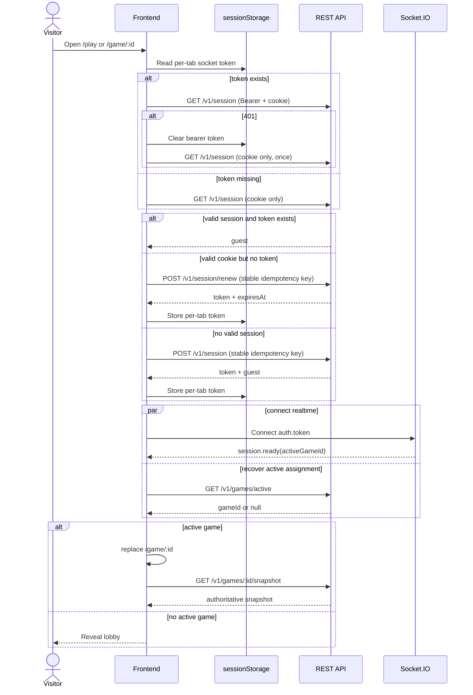
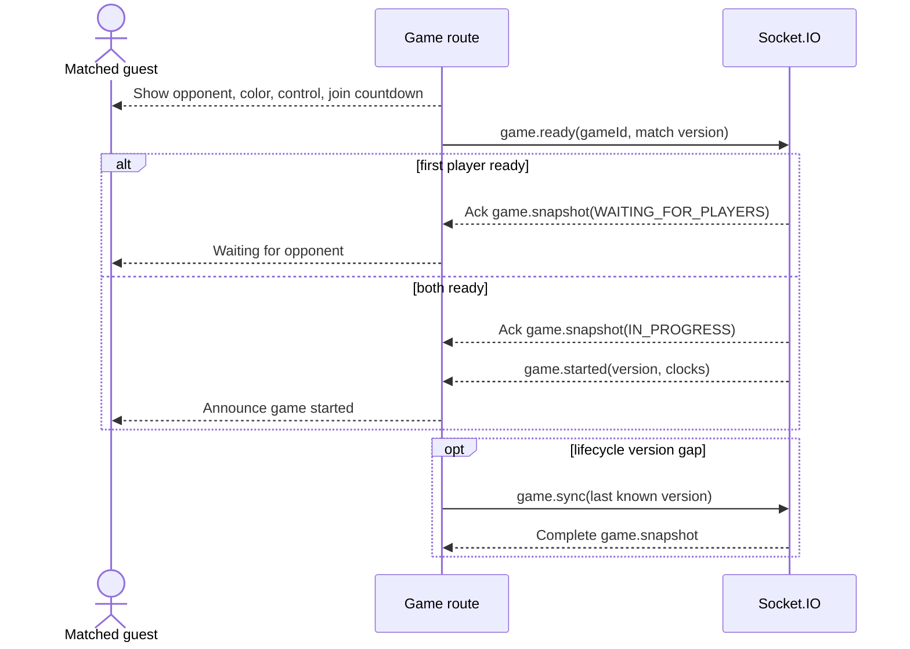
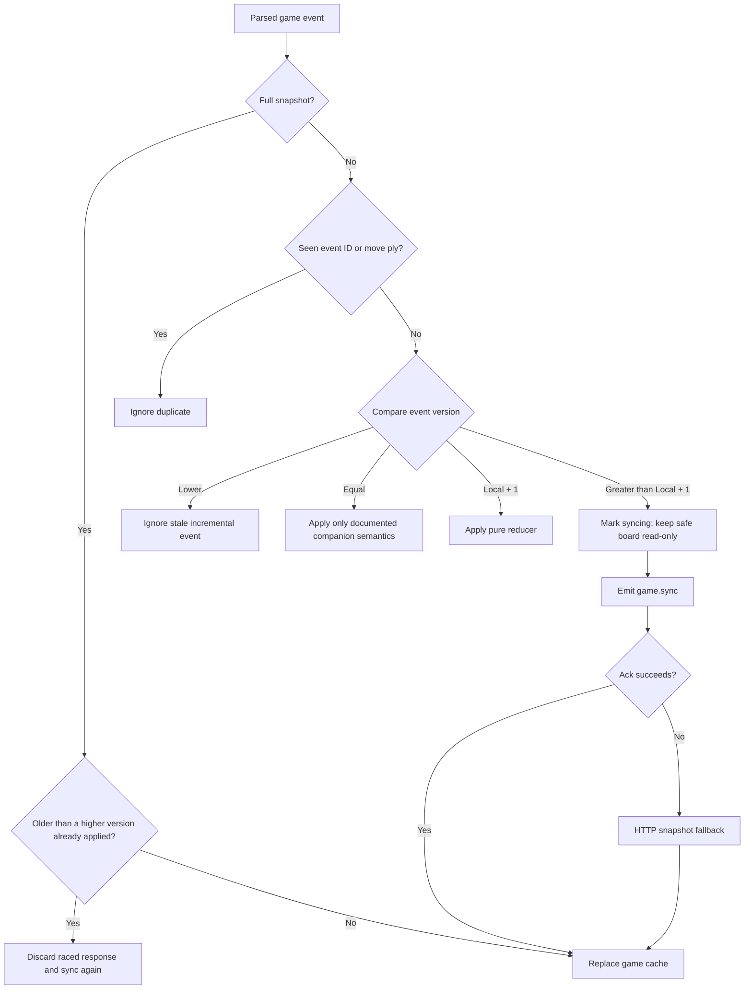
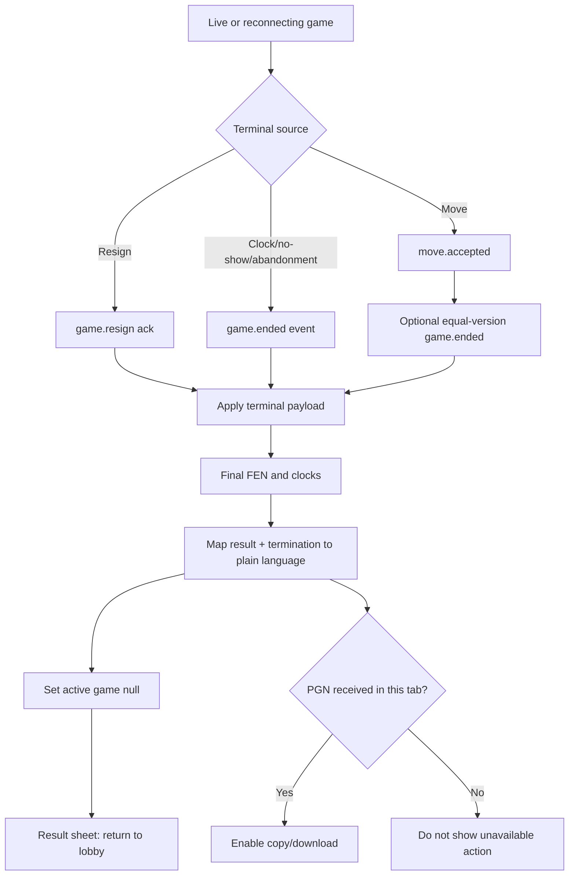

# Frontend User Flows

> **Status:** Frozen for implementation
> **Authority:** [`../protocol-v1.md`](../protocol-v1.md) and accepted frontend
> ADRs

The diagrams show frontend orchestration. Server responses and snapshots remain
authoritative even when a local UI state has a similar name.

## 1. Guest bootstrap and active-game recovery



### Rules

- The bootstrap coordinator is single-flight per tab.
- A bearer `401` cannot immediately create a new guest; cookie-only recovery is
  tried once.
- Create/renew retry uses the same idempotency key.
- `session.ready` and active-game REST disagreement triggers one fresh
  active-game read rather than a guessed route.

## 2. Lobby and matchmaking

```mermaid
sequenceDiagram
    actor U as Guest
    participant F as Lobby
    participant WS as Socket.IO

    U->>F: Choose Find a match
    F->>F: state = joining; disable duplicate input
    F->>WS: queue.join(eventId, blitz)
    alt acknowledgement success
        WS-->>F: queue.joined(since, position?)
        F->>F: state = queued; persist queue intent
    else ALREADY_IN_GAME
        WS-->>F: server.error
        F->>F: Recover active game
    else RATE_LIMITED or SERVICE_UNAVAILABLE
        WS-->>F: retryable error
        F-->>U: Inline wait/retry state
    end

    alt user cancels
        U->>F: Cancel search
        F->>WS: queue.leave(same attempt IDs on retry)
        WS-->>F: queue.left(requested)
        F->>F: Clear queue state and intent
    else match allocated
        WS-->>F: queue.left(matched)
        WS-->>F: match.found(gameId, version, color, opponent, deadline)
        F->>F: Clear queue; retain provisional match metadata
        F->>F: Navigate /game/:id
    end
```

### Reconnect rule

If the tab reconnects with queue intent but no active game, repeat
`queue.join`. The backend returns the existing queue state without duplicating
the queue member.

## 3. Match readiness and game start



The join countdown is informative. The frontend never declares a no-show.

## 4. Move proposal, acknowledgement, and broadcast

```mermaid
sequenceDiagram
    actor U as Player
    participant B as Board UI
    participant R as Realtime reducer
    participant WS as Socket.IO

    U->>B: Select/drag piece and target
    B->>B: Show local legal hints
    opt promotion
        B-->>U: Promotion chooser
        U->>B: Choose q/r/b/n
    end
    B->>B: Create eventId + clientMoveId
    B->>B: Render pending overlay; block second local move
    B->>WS: move.submit(expectedVersion, from, to, promotion?)

    alt ack succeeds first
        WS-->>R: Ack move.accepted(version, ply, FEN, clocks)
        R->>B: Apply authoritative move once
        WS-->>R: Broadcast move.accepted
        R->>R: Dedupe by ply/version
    else broadcast succeeds first
        WS-->>R: Broadcast move.accepted
        R->>B: Apply authoritative move once
        WS-->>R: Ack move.accepted
        R->>R: Dedupe by ply/version
    else definitive rejection
        WS-->>B: move.rejected
        B->>B: Remove overlay; preserve authoritative board
        B-->>U: Announce mapped reason
    else acknowledgement timeout
        B->>WS: Retry same eventId + clientMoveId
        alt still uncertain
            B->>WS: game.sync
            WS-->>R: Complete snapshot
            R->>B: Replace authoritative game; clear pending
        end
    end
```

Client `chess.js` supplies target hints only. The backend determines legality,
turn, check, clocks, and result.

## 5. Version gap and snapshot recovery



## 6. Disconnect and reconnect

```mermaid
sequenceDiagram
    actor U as Player
    participant F as Frontend
    participant WS as Socket.IO
    participant API as REST API

    WS-->>F: transport disconnected
    F-->>U: Keep last safe board; show reconnecting
    Note over F: Clocks continue from last server base

    alt transport reconnects
        F->>WS: Re-authenticate with current token
        WS-->>F: session.ready(activeGameId)
        WS-->>F: game.snapshot
        F-->>U: Clear transport banner
    else token missing but cookie valid
        F->>API: Renew with stable key
        API-->>F: new token
        F->>WS: Reconnect
    else socket recovery fails
        F->>API: GET game snapshot
        API-->>F: snapshot or typed error
    end

    opt opponent's final socket disconnects
        WS-->>F: player.disconnected(graceDeadline, clocksContinue=true)
        F-->>U: Show grace state without pausing clock
    end

    opt opponent reconnects
        WS-->>F: player.reconnected
        WS-->>F: game.snapshot
        F-->>U: Clear opponent grace state
    end
```

## 7. Terminal game



The frontend does not infer terminal state from a displayed zero clock or
client chess engine.

## 8. Identity reset

```mermaid
sequenceDiagram
    actor U as Guest
    participant F as Settings
    participant API as REST API
    participant WS as Socket.IO
    participant S as Browser storage/cache

    U->>F: Start with a new identity
    alt active game
        F-->>U: Warn: reset immediately abandons the game
    else no active game
        F-->>U: Warn: identity cannot be recovered
    end
    U->>F: Confirm
    F->>API: POST /v1/session/reset (stable key)
    alt success
        API-->>F: ok
        F->>WS: Disconnect
        F->>S: Clear token, pending keys, queue intent, Query and guest stores
        F->>F: replace /
    else retryable failure
        API-->>F: error + correlation ID
        F-->>U: Keep dialog state; retry same key
    else definitive failure
        API-->>F: error
        F-->>U: Explain and offer safe exit
    end
```

## Cross-flow invariants

- Never enable two concurrent local move submissions.
- Never retry a semantic command with new identifiers.
- Never erase a safe board because the network is unavailable.
- Never expose raw backend error codes as primary user copy.
- Never create a new guest merely because a socket connection failed.
- Never treat a route guard or cached active-game ID as authorization.
- Every uncertain state converges through sync, HTTP snapshot, or explicit user
  recovery.
